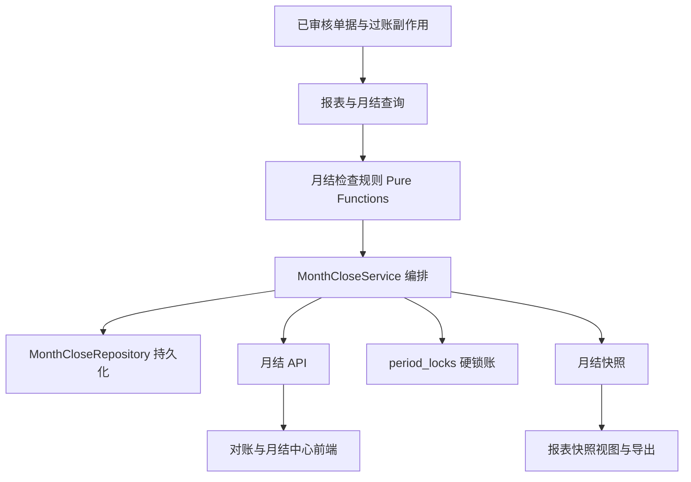

# 对账与月结中心实施计划

> **Superpowers 执行要求：** 后续开发必须按 `superpowers:subagent-driven-development`（推荐）或 `superpowers:executing-plans` 执行。每个任务都必须按 TDD 拆成 RED、GREEN、审查、提交四步；步骤使用 checkbox 记录状态。

日期：2026-04-26

状态：v2 计划。基于《对账与月结中心设计方案》重新整理，并纳入当前代码仓库真实进度。

## 1. 目标

建设正式的“对账与月结中心”，把现有报表、异常检查和期间锁账升级为可审计的月结闭环：

- 运行月结检查。
- 识别并处理 critical / warning / info 异常。
- 展示资金、备用金、借款、项目经营对账汇总。
- 在检查通过后锁账。
- 锁账时生成月结快照。
- 报表中心可区分实时数据和已结账快照。

核心原则：

- 已审核单据及其过账副作用仍是唯一会计源数据。
- 月结快照只用于归档、审计和导出，不反向参与过账。
- `period_locks` 仍是硬锁账开关。
- 月结中心负责锁账前检查、处理闭环、快照版本和用户操作流。

## 2. 当前进度

已经完成：

- [x] Task 1 RED：月结 Repository 持久化测试。
  - Commit：`e9db40c test: cover month close repository persistence`
- [x] Task 1 GREEN：月结表结构和 `MonthCloseRepository`。
  - Commit：`16803b4 feat: add month close repository persistence`
- [x] Task 2 RED：月结检查规则测试已写入。
  - Commit：`0747b47 test: cover month close check rules`
- [x] Task 2 GREEN：月结检查规则纯函数已实现。
  - Commit：本次提交 `feat: add month close check rules`

当前注意事项：

- Task 1 无需重做。
- Task 2 已进入 GREEN 验证，下一步是提交后进入 Task 3 服务编排。

## 3. 源文档

- 设计方案：`docs/superpowers/specs/2026-04-26-reconciliation-month-end-center-design.md`
- 本实施计划：`docs/superpowers/plans/2026-04-26-reconciliation-month-end-center.md`
- 已有期间锁账 API：`src/api/periodLocks.ts`
- 已有期间锁账仓储：`src/repositories/periodLockRepository.ts`
- 已有报表仓储：`src/repositories/reportRepository.ts`
- 已有审计仓储：`src/repositories/auditLogRepository.ts`
- 已有报表前端：`src/app/pages/ReportsPage.tsx`
- 已有期间锁账前端：`src/app/pages/PeriodLocksPage.tsx`

## 4. 分层架构



分层边界：

- Repository 只负责 D1 持久化，不做业务判断。
- Check Rules 只做纯函数判断，不读数据库。
- Service 负责编排检查、状态变更、锁账、解锁、快照和审计。
- API 只做参数解析、权限控制和响应格式。
- 前端只消费 API，不自行计算会计口径。

## 5. 领域常量

后端和前端测试应保持一致：

```ts
export const MONTH_CLOSE_STATUSES = ["open", "checking", "ready_to_lock", "locked", "reopened"] as const;
export const MONTH_CLOSE_RUN_STATUSES = ["running", "completed", "failed"] as const;
export const MONTH_CLOSE_SEVERITIES = ["critical", "warning", "info"] as const;
export const MONTH_CLOSE_RESULT_STATUSES = ["open", "assigned", "acknowledged", "resolved", "waived"] as const;
```

锁账判定：

- 最近一次检查运行必须完成。
- 不存在未处理 critical。
- warning 必须是 `resolved`、`acknowledged` 或 `waived`。
- info 不阻断锁账。
- 锁账备注必填。
- 期间不能已存在于 `period_locks`。

## 6. Task 1：月结持久化层

状态：已完成。

文件：

- [x] `migrations/0008_month_close_center.sql`
- [x] `src/repositories/monthCloseRepository.ts`
- [x] `tests/api/monthCloseRepository.test.ts`

已实现能力：

- [x] 创建检查运行 `createRun`
- [x] 完成检查运行 `completeRun`
- [x] 标记检查失败 `failRun`
- [x] 插入检查结果 `insertCheckResults`
- [x] 查询最近运行 `latestRun`
- [x] 查询运行历史 `listRuns`
- [x] 查询检查结果 `listCheckResults`
- [x] 更新检查处理状态 `updateCheckResult`
- [x] 获取下一个快照版本 `nextSnapshotVersion`
- [x] 创建快照和报表快照 `createSnapshotWithReports`
- [x] 查询快照列表 `listSnapshots`
- [x] 查询快照头 `getSnapshot`
- [x] 查询报表快照 `getReportSnapshot`

审查结论：

- Repository 没有做状态流转合法性判断，符合分层设计；状态流转由 Task 3 Service 负责。
- `createSnapshotWithReports` 使用 D1 batch 写入快照头和明细，符合后续锁账原子化的基础要求。
- Task 1 无需重做。

## 7. Task 2：月结检查规则纯函数

状态：已完成。

文件：

- [x] `tests/services/monthCloseChecks.test.ts`
- [x] `src/services/monthCloseChecks.ts`

### 7.1 RED

- [x] 写失败测试。
- [x] 运行：

```bash
npm test -- tests/services/monthCloseChecks.test.ts
```

当前预期失败原因：

```text
Cannot find module '../../src/services/monthCloseChecks'
```

### 7.2 GREEN

- [x] 创建 `src/services/monthCloseChecks.ts`。

必须导出：

- [x] `MonthCloseCheckOptions`
- [x] `MonthCloseCheckResultInput`
- [x] `MonthCloseHandledCheckResult`
- [x] `documentWorkflowChecks`
- [x] `accountBalanceChecks`
- [x] `pendingCostChecks`
- [x] `loanAgingChecks`
- [x] `projectIntegrityChecks`
- [x] `summarizeCheckResults`
- [x] `canLockFromCheckResults`

检查规则：

- pending 单据 -> `pending_document` / `critical`
- draft 单据 -> `draft_document` / `info`
- rejected 单据 -> `rejected_document` / `warning`
- 公司账户负数 -> `negative_company_account` / `critical`
- 备用金负数 -> `negative_petty_cash` / `warning`
- 待匹配成本 -> `pending_cost` / `warning`
- 超期待匹配成本 -> `stale_pending_cost` / `critical`
- 超期借款 -> `stale_loan` / `warning`
- 项目收入缺少商户 -> `project_income_missing_merchant` / `critical`
- 商户归属项目与单据项目不一致 -> `merchant_project_mismatch` / `critical`

验收命令：

```bash
npm test -- tests/services/monthCloseChecks.test.ts
npx tsc --noEmit
```

提交：

```bash
git add src/services/monthCloseChecks.ts tests/services/monthCloseChecks.test.ts
git commit -m "feat: add month close check rules"
```

## 8. Task 3：月结服务编排

状态：已完成。

文件：

- [x] `src/services/monthCloseService.ts`
- [x] `tests/services/monthCloseService.test.ts`
- [x] 本任务未扩展 `src/repositories/reportRepository.ts`；先通过 `MonthCloseSourceRepository` 窄接口承接五类源查询，真实 SQL 留到 Task 4/接口接入阶段。

目标：

- 把数据库查询结果喂给 Task 2 的纯规则。
- 创建并完成检查运行。
- 持久化检查结果。
- 计算 critical / warning / info 数量。
- 判断 `can_lock`。
- 失败时把运行标记为 `failed` 并记录错误。

TDD 步骤：

- [x] RED：写 `runChecks(period, actor)` 服务测试。提交：`f38b159 test: cover month close service orchestration`。
- [x] GREEN：实现最小服务。提交：`730ec0f feat: add month close service orchestration`。
- [x] 审查：确认 Service 不绕过 Repository、不直接拼接用户 SQL；代码质量审查问题已在 `59e3278 fix: harden month close service result contract` 修复并复审 PASS。
- [x] 提交。

必须覆盖：

- `runChecks` 创建 running run。
- 成功后变成 completed。
- open critical 使 `can_lock = 0`。
- warning 未处理使 `can_lock = 0`。
- 无阻断项时 `can_lock = 1`。
- 查询或插入失败时 run 变成 failed。

建议新增查询：

- `documentWorkflowRows(period)`
- `accountBalanceRowsForMonthClose(period)`
- `pendingCostRowsForMonthClose(period)`
- `loanAgingRowsForMonthClose(period)`
- `projectIntegrityRows(period)`

验收命令：

```bash
npm test -- tests/services/monthCloseService.test.ts tests/services/monthCloseChecks.test.ts
npx tsc --noEmit
```

已执行补充验收：

```bash
npm test
npm run build
npm audit --audit-level=high
git diff --check
```

## 9. Task 4：月结检查 API

状态：已完成。

文件：

- [x] `src/api/monthClose.ts`
- [x] `src/worker/router.ts`
- [x] `tests/api/monthClose.test.ts`
- [x] `src/repositories/reportRepository.ts`：补齐五类月结源数据查询。
- [x] `src/repositories/monthCloseRepository.ts`：补齐期间列表查询。
- [x] `tests/api/reportRepository.test.ts`：补齐五类月结源查询 SQLite 执行测试。

API：

| 方法 | 路径 | 权限 |
| --- | --- | --- |
| `GET` | `/api/month-close/periods` | `periodLocks.view` |
| `GET` | `/api/month-close/:period` | `periodLocks.view` |
| `POST` | `/api/month-close/:period/checks/run` | `periodLocks.lock` |
| `GET` | `/api/month-close/:period/checks` | `periodLocks.view` |
| `PATCH` | `/api/month-close/check-results/:id` | `periodLocks.lock` |

TDD 步骤：

- [x] RED：写路由和 handler 测试。提交：`c87d634 test: cover month close API`。
- [x] GREEN：实现 handlers、router、五类源查询。提交：`08249fa feat: add month close check API`。
- [x] 审查：确认权限先于写操作，错误响应不泄漏内部 SQL；已用测试覆盖无权限写入、invalid period、PATCH 审计和泛化错误响应。
- [x] 提交。

必须覆盖：

- 无权限用户不能运行检查或更新结果。
- invalid period 返回 400。
- `acknowledged` / `waived` 必须填写处理说明。
- PATCH 写入审计日志。

验收命令：

```bash
npm test -- tests/api/monthClose.test.ts tests/api/periodLocks.test.ts
npx tsc --noEmit
```

已执行补充验收：

```bash
npm test -- tests/api/monthClose.test.ts tests/api/periodLocks.test.ts tests/api/reportRepository.test.ts
npm test
npm run build
npm audit --audit-level=high
git diff --check
```

## 10. Task 5：月结中心前端 MVP

状态：待做。

文件：

- [ ] `src/app/pages/MonthClosePage.tsx`
- [ ] `src/app/pages/month-close/monthCloseTypes.ts`
- [ ] `src/app/pages/month-close/monthCloseModel.ts`
- [ ] `src/app/pages/month-close/monthCloseModel.test.ts`
- [ ] `src/app/pages/month-close/MonthClosePeriodList.tsx`
- [ ] `src/app/pages/month-close/MonthCloseStatusBar.tsx`
- [ ] `src/app/pages/month-close/MonthCloseChecksTab.tsx`
- [ ] `src/app/session/sessionTypes.ts`
- [ ] `src/app/session/sessionModel.ts`
- [ ] `src/app/session/sessionModel.test.ts`
- [ ] `src/app/App.tsx`
- [ ] `src/app/styles.css`

范围：

- 新增一级导航 `对账月结`。
- 期间列表。
- 期间状态条。
- 检查清单。
- 运行检查。
- 刷新。
- 确认保留。
- 标记已处理。
- 分配责任人。

不做：

- 不做对账汇总 tabs。
- 不做锁账按钮。
- 不做快照归档。

验收命令：

```bash
npm test -- src/app/pages/month-close/monthCloseModel.test.ts src/app/session/sessionModel.test.ts src/app/App.test.tsx
npx tsc --noEmit
npm run build
```

## 11. Task 6：对账汇总 Tabs

状态：待做。

文件：

- [ ] `src/services/monthCloseService.ts`
- [ ] `src/api/monthClose.ts`
- [ ] `src/app/pages/month-close/MonthCloseReconciliationTabs.tsx`
- [ ] `tests/services/monthCloseService.test.ts`
- [ ] `tests/api/monthClose.test.ts`

接口：

```http
GET /api/month-close/:period/reconciliation
```

返回：

```ts
{
  data: {
    funding: [],
    pettyCash: [],
    loans: [],
    projects: []
  }
}
```

对账页签：

- 资金对账
- 备用金
- 借款
- 项目经营

要求：

- 只渲染当前激活 tab 的明细表。
- 多币种按原币分组，不混币种汇总。
- 期初余额第一版可按期间前累计分录计算。

## 12. Task 7：锁账、解锁与快照

状态：待做。

文件：

- [ ] `src/services/monthCloseService.ts`
- [ ] `src/api/monthClose.ts`
- [ ] `src/repositories/monthCloseRepository.ts`
- [ ] 必要时扩展 `src/repositories/periodLockRepository.ts`
- [ ] `tests/services/monthCloseService.test.ts`
- [ ] `tests/api/monthClose.test.ts`

新增 API：

| 方法 | 路径 | 权限 |
| --- | --- | --- |
| `POST` | `/api/month-close/:period/lock` | `periodLocks.lock` |
| `POST` | `/api/month-close/:period/unlock` | `periodLocks.unlock` |

锁账必须原子化：

1. 验证最近检查运行。
2. 验证不存在未处理 critical。
3. 验证 warning 已处理。
4. 写 `period_locks`。
5. 写 `month_close_snapshots`。
6. 写 `month_close_report_snapshots`。
7. 写审计日志。

快照初始 report keys：

- `accountBalances`
- `lotBalances`
- `lotMovements`
- `pettyCashPending`
- `pendingCosts`
- `loanBalances`
- `loanAging`
- `projectProfitLoss`
- `projectIncome`
- `merchantIncome`
- `expenseDetails`
- `expenseSummary`
- `monthlyOperatingSummary`
- `exceptionChecks`
- `monthCloseChecks`
- `monthCloseReconciliation`

## 13. Task 8：快照查看与报表版本切换

状态：待做。

文件：

- [ ] `src/api/monthClose.ts`
- [ ] `src/app/pages/month-close/MonthCloseSnapshotsTab.tsx`
- [ ] `src/app/pages/ReportsPage.tsx`
- [ ] `src/app/pages/reports/reportTypes.ts`
- [ ] `src/app/pages/reports/reportExport.ts`
- [ ] `tests/api/monthClose.test.ts`
- [ ] `src/app/pages/ReportsPage.test.tsx`

新增 API：

| 方法 | 路径 | 权限 |
| --- | --- | --- |
| `GET` | `/api/month-close/:period/snapshots` | `periodLocks.view` |
| `GET` | `/api/month-close/snapshots/:id/reports/:reportKey` | `reports.view` |

报表中心版本：

- 实时数据。
- 已结账快照。

导出命名：

```text
项目经营报表-2026-04-v1.csv
月结包-2026-04-v1.xlsx
```

## 14. Task 9：最终验收与部署准备

状态：待做。

必须运行：

```bash
npm test
npx tsc --noEmit
npm run build
npm audit --audit-level=high
git diff --check
```

本地数据库烟测：

```bash
npm run db:migrate:local
npm run db:seed:local
npm run cf:dev
```

人工验收：

- 打开系统。
- 进入 `对账月结`。
- 选择演示期间。
- 运行检查。
- 处理 warning。
- critical 未处理时锁账被阻断。
- 处理后可锁账。
- 快照生成。
- 报表中心可查看快照版本。

## 15. 推荐执行顺序

必须顺序执行：

1. Task 2：先补齐 RED 后的检查规则实现。
2. Task 3：服务编排。
3. Task 4：API。
4. Task 5：前端 MVP。
5. Task 6：对账汇总。
6. Task 7：锁账和快照。
7. Task 8：快照报表。
8. Task 9：最终验收。

不要提前：

- 不要在 Task 7 前做报表快照切换。
- 不要在 Task 4 前做前端真实 API 联调。
- 不要在 Service 层测试前把锁账入口暴露给前端。

## 16. 完成标准

整个计划完成时必须满足：

- 月结检查可运行并持久化。
- 检查结果可处理、确认保留、标记已解决。
- critical 未处理时不能锁账。
- warning 未处理时不能锁账。
- 锁账写入 `period_locks`。
- 锁账生成快照版本。
- 解锁保留历史快照。
- 重新锁账生成新快照版本。
- 报表中心能区分实时数据和已结账快照。
- 全量测试、类型检查、构建、安全审计全部通过。
