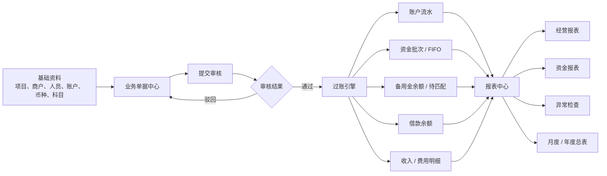
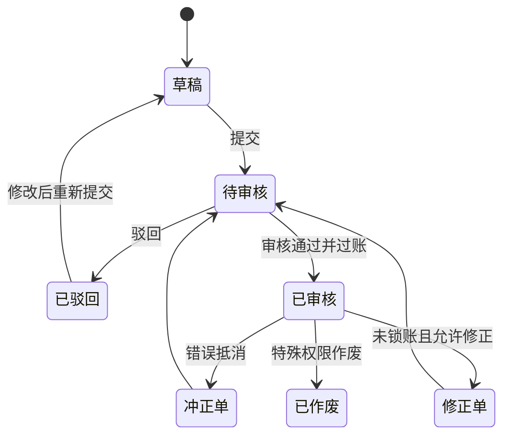
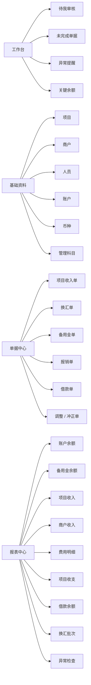
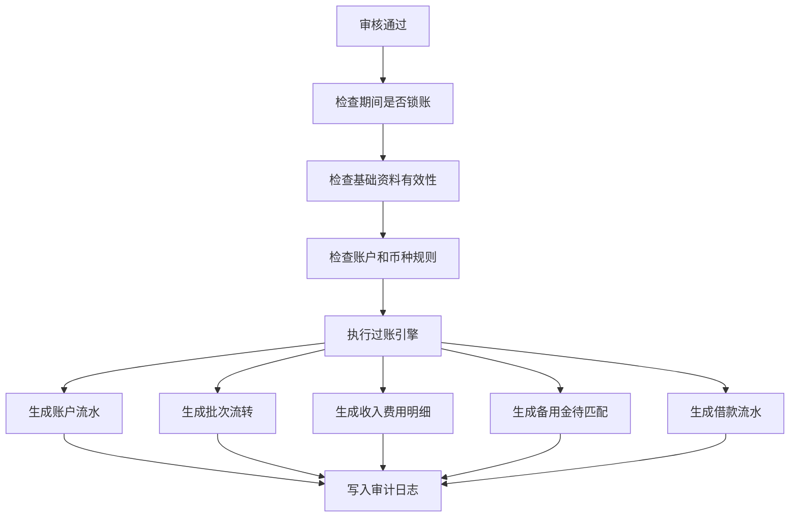
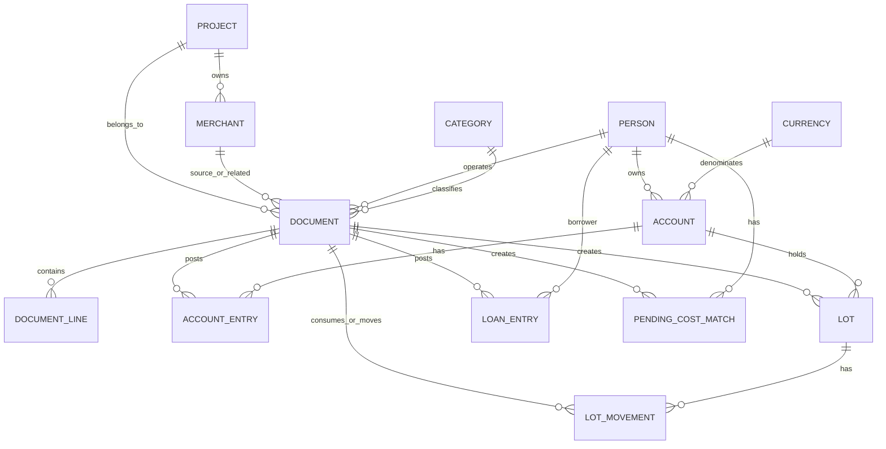
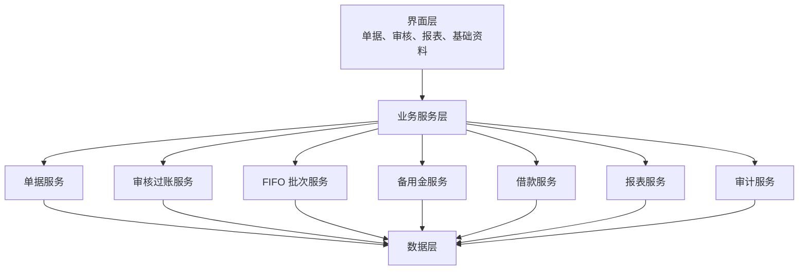

# 内部管理会计台账正式系统整体方案

日期：2026-04-24

状态：已与业务方逐段确认，作为后续实施计划的设计依据。

## 1. 系统定位

本系统定位为内部管理会计台账系统，不是正式财务会计软件，也不是简单 Excel 替代品。

系统目标是用结构化源单据替代不规范明细表，并由已审核源数据自动生成资金、备用金、借款、项目经营和异常检查报表。

核心原则：

- 所有真实数据来自源单据。
- 报表不允许手工维护。
- 草稿不影响余额。
- 待审核只进入预估口径。
- 已审核才进入正式口径。
- 错误通过修正或冲正处理。
- 已锁账期间原则上不直接修改原单。
- USDT 是基础货币。
- 多币种资金按换汇批次和 FIFO 成本管理。
- 备用金允许为负数，用于表达人员垫付和公司待补。
- 费用按实际消费日期归属。

## 2. 核心命名口径

| 概念 | 口径 |
| --- | --- |
| 项目 | 内部核算主体。原表中的“部门”在新系统中统一命名为“项目”。 |
| 商户 | 项目收入来源或经营对象。原表中的“站点”在新系统中统一命名为“商户”。 |
| 项目收入 | 项目的收入来自商户，并归集到项目。 |
| 账户 | 资金所在位置，例如 USDT 钱包、AED 储备账户、人员备用金账户。 |
| 备用金 | 公司拨给人员使用的资金，可为正数、零或负数。 |
| 资金批次 | 非 USDT 资金的成本来源批次，主要由换汇产生。 |
| FIFO | 同一账户、同一币种下按批次日期先进先出消耗。 |
| 冲正 | 通过关联原单的反向单据抵消错误影响。 |
| 修正 | 在允许范围内修改错误单据，并保留修改前版本和原因。 |

## 3. 整体数据流

数据流解释：

- 基础资料决定单据可选择的项目、商户、人员、账户、币种和管理科目。
- 业务单据是唯一源数据入口。
- 审核通过后，过账引擎把单据转为账户流水、批次流转、备用金待匹配、借款流水、收入费用明细。
- 报表中心只读取已生成的正式业务结果，不允许手工维护报表数据。

## 4. 统一单据生命周期

规则：

- 草稿可以编辑，不影响余额和正式报表。
- 待审核不可随意修改，撤回或驳回后才能编辑。
- 已审核代表正式入账，不允许直接删除。
- 冲正和修正必须关联原单，并填写原因。
- 已锁账期间优先使用冲正，不直接修改原单。

## 5. 模块边界

正式系统分为以下模块：

| 模块 | 主要职责 | 是否直接写余额 |
| --- | --- | --- |
| 工作台 | 待审核、未完成单据、异常提醒、关键余额 | 否 |
| 基础资料 | 项目、商户、人员、账户、币种、管理科目 | 否 |
| 单据中心 | 创建、编辑、提交业务单据 | 否 |
| 审核中心 | 审核、驳回、过账、冲正、修正 | 通过过账生成 |
| 资金批次 | 查看换汇批次、FIFO 消耗、批次余额 | 否 |
| 备用金 | 查看人员备用金、待匹配成本、报销状态 | 否 |
| 借款 | 查看借款人余额、还款、核销状态 | 否 |
| 报表中心 | 经营、资金、往来、异常、月度年度报表 | 否 |
| 期间与锁账 | 月度锁账、解锁、跨期规则 | 否 |
| 审计日志 | 查看关键操作记录 | 否 |

核心边界是：只有审核过账会生成余额影响。用户不能在账户余额、备用金余额、借款余额或报表中直接改数字。

## 6. 页面结构

角色视角：

| 角色 | 主要看到 |
| --- | --- |
| 管理员 | 全部模块、系统设置、锁账、调整 |
| 财务主管 | 审核中心、报表中心、锁账、冲正修正 |
| 财务录入 | 基础资料、单据中心、本人创建的单据 |
| 后勤人员 | 个人备用金、报销提交、报销状态 |
| 管理层/只读 | 工作台、报表中心、异常检查 |

## 7. 核心单据类型

所有单据共享头部字段：

- 单据编号
- 单据类型
- 业务动作：正常、冲正、修正、重录
- 业务日期
- 所属期间
- 经办人
- 项目
- 商户
- 摘要
- 附件
- 状态
- 原单据
- 创建人、创建时间
- 审核人、审核时间

### 7.1 项目收入单

用途：记录项目从商户取得的收入。

关键字段：

- 项目
- 商户
- 收款账户
- 币种
- 原币金额
- USDT 折算金额
- 收入科目
- 收入日期

审核后影响：

- 增加收款账户余额。
- 生成项目收入明细。
- 生成商户收入明细。
- 进入项目收支报表。

### 7.2 换汇单

用途：记录 USDT 和 AED 等币种之间的转换。

关键字段：

- 转出账户、转出币种、转出金额
- 转入账户、转入币种、转入金额
- 实际汇率
- 手续费
- 换汇日期

审核后影响：

- 转出账户减少。
- 转入账户增加。
- 生成转入币种资金批次。
- 记录该批次对应的 USDT 成本。
- 不确认费用。

### 7.3 账户转账单

用途：记录同币种账户之间的资金转移。

关键字段：

- 转出账户
- 转入账户
- 币种
- 金额
- 手续费
- 转账日期

审核后影响：

- 转出账户减少。
- 转入账户增加。
- 如果账户下有资金批次，按 FIFO 把批次位置从转出账户转到转入账户。
- 不确认收入或费用。

### 7.4 备用金领取单

用途：公司把储备金发给后勤人员。

关键字段：

- 领取人
- 转出账户
- 人员备用金账户
- 币种
- 金额
- 领取日期

审核后影响：

- 公司储备账户减少。
- 人员备用金账户增加。
- FIFO 转移对应资金批次到人员名下。
- 不确认费用。

### 7.5 备用金退回单

用途：人员退回未使用备用金。

关键字段：

- 退回人
- 人员备用金账户
- 收回账户
- 币种
- 金额
- 退回日期

审核后影响：

- 人员备用金账户减少。
- 公司账户增加。
- FIFO 或指定批次回流到公司账户。
- 不确认费用。

### 7.6 备用金报销单

用途：确认真实消费。

关键字段：

- 报销人
- 实际消费日期
- 提交日期
- 项目
- 商户，可选
- 费用科目
- 币种
- 原币金额
- 附件

审核后影响：

- 按实际消费日期确认费用。
- 消耗人员备用金账户。
- 按 FIFO 匹配 USDT 成本。
- 备用金不足时允许余额变负。
- 生成待匹配成本。

### 7.7 借款支出单

用途：记录公司借出资金。

关键字段：

- 借款人
- 付款账户
- 币种
- 原币金额
- USDT 成本
- 借款用途
- 借款日期

审核后影响：

- 付款账户减少。
- 借款人余额增加。
- 不进入费用报表。

### 7.8 借款收回单

用途：记录借款人还款。

关键字段：

- 借款人
- 收款账户
- 币种
- 原币金额
- 对应借款，允许不指定；未指定时按借款人和币种汇总冲减最早未还余额
- 收回日期

审核后影响：

- 收款账户增加。
- 借款人余额减少。
- 不进入收入报表。

### 7.9 借款核销单

用途：确认借款无法收回，或批准转为费用/损失。

关键字段：

- 借款人
- 核销金额
- 核销科目
- 项目，如需归属项目则填写
- 审批人
- 核销日期
- 附件

审核后影响：

- 借款余额减少。
- 进入费用或损失报表。

### 7.10 手工调整单

用途：处理历史初始化、特殊差异、分类修正。

关键字段：

- 调整对象
- 调整方向
- 币种和金额
- 调整原因
- 审批人
- 附件

审核后影响：

- 根据调整对象生成对应流水。
- 必须进入审计日志。
- 不应替代正常业务单据。

### 7.11 冲正和修正

冲正和修正不是独立业务类型，而是业务动作。

| 动作 | 口径 |
| --- | --- |
| 冲正 | 对原单生成相反影响，原单保留。 |
| 修正 | 未锁账时允许修改错误字段，保留版本。 |
| 重录 | 冲正后重新录入正确单据。 |

规则：

- 冲正和修正必须关联原单。
- 必须填写原因。
- 已锁账期间优先冲正。
- 不允许通过直接修改余额解决错误。

## 8. 多币种、FIFO 和备用金成本规则

### 8.1 基础货币

系统基础货币是 USDT。

所有报表至少保留两套金额：

| 金额 | 说明 |
| --- | --- |
| 原币金额 | 实际发生的币种金额，例如 AED 100。 |
| USDT 成本 | 该原币金额对应消耗的 USDT 成本。 |

### 8.2 资金批次

凡是非 USDT 资金，都需要形成资金批次。

批次来源：

- 换汇生成。
- 外币收入生成。
- 历史初始化。
- 手工调整。

批次字段：

- 批次编号
- 币种
- 原始金额
- 剩余金额
- 原始 USDT 成本
- 剩余 USDT 成本
- 来源单据
- 当前账户
- 当前责任人
- 批次日期

### 8.3 FIFO 消耗

同一账户、同一币种下，按批次日期先进先出。

适用场景：

- 备用金领取
- 备用金退回
- 备用金报销
- 账户转账
- 借款支出
- 外币付款
- 冲正
- 调整

领取备用金时，批次不是消失，而是从公司储备账户转移到人员备用金账户。

### 8.4 备用金为负数

备用金状态：

| 状态 | 含义 |
| --- | --- |
| 正数 | 人员手里还有公司备用金。 |
| 0 | 刚好用完。 |
| 负数 | 人员已垫付，公司待补。 |

备用金负数不是错误，但属于需要关注的管理状态。

### 8.5 备用金报销和待匹配成本

报销审核后：

- 按实际消费日期确认费用。
- 检查人员备用金账户的同币种批次。
- 批次足够时，按 FIFO 消耗批次并确认 USDT 成本。
- 批次不足时，备用金余额允许变负。
- 已有批次部分确认 USDT 成本。
- 不足部分生成待匹配成本。

待匹配成本字段：

- 报销单
- 人员
- 备用金账户
- 币种
- 待匹配原币金额
- 消费日期
- 状态：未匹配、部分匹配、已匹配

后续补备用金时：

- 先检查该人员同币种待匹配。
- 按待匹配产生时间优先匹配。
- 将补入批次的 USDT 成本分配给历史待匹配费用。
- 更新费用报表中的 USDT 成本。
- 补款超过待匹配金额时，剩余部分成为正常备用金。

### 8.6 费用成本口径

费用报表应展示：

- 实际消费日期
- 项目
- 商户，可选
- 科目
- 报销人
- 原币金额
- 已匹配 USDT 成本
- 待匹配原币金额
- 成本状态：已完整匹配、部分匹配、未匹配

如果存在待匹配费用，项目净额不能被标记为完整准确，必须显示成本完整性状态。

### 8.7 冲正下的 FIFO

如果原单已经消耗批次，冲正时应优先按原单批次消耗记录反向恢复，而不是重新跑一次 FIFO。

如果原批次已被后续单据继续消耗，系统应标记为复杂冲正，需要高权限处理并保留审计记录。

## 9. 报表体系

正式系统报表分为四类：

- 经营分析报表
- 资金管理报表
- 往来与备用金报表
- 异常检查报表

所有报表只由已审核源单据生成，不能手工改报表数据。

### 9.1 经营分析报表

经营分析回答：

- 每个项目收入多少。
- 收入来自哪些商户。
- 项目费用是多少。
- 项目净额是多少。
- 哪些商户增长或下降。
- 哪些费用科目占比高。

建议报表：

| 报表 | 用途 |
| --- | --- |
| 项目收支表 | 按项目汇总收入、费用、净额。 |
| 项目收入表 | 按项目、月份、币种、收入科目汇总。 |
| 商户收入表 | 查看每个商户贡献的收入。 |
| 商户趋势表 | 查看商户月度收入、占比、环比变化。 |
| 费用明细表 | 查看每笔费用的项目、商户、科目、人员。 |
| 费用汇总表 | 按项目、月份、科目、人员汇总。 |
| 月度经营总表 | 管理层查看整体月度经营结果。 |
| 年度经营总表 | 管理层查看年度趋势。 |

项目收支表字段：

- 期间
- 项目
- 收入原币
- 收入 USDT
- 费用原币
- 已匹配费用 USDT
- 待匹配费用原币
- 项目净额 USDT
- 成本完整性

### 9.2 资金管理报表

资金管理回答：

- 公司每个账户现在有多少钱。
- AED 储备金来自哪些换汇批次。
- 每个批次还剩多少。
- 某笔费用消耗了哪个批次。
- 哪些账户不应该为负但变负了。

建议报表：

| 报表 | 用途 |
| --- | --- |
| 账户余额表 | 按账户、币种显示余额。 |
| 资金流水表 | 查看账户每笔增减。 |
| 换汇批次表 | 查看每个外币批次的来源和剩余。 |
| FIFO 消耗明细 | 查看每笔消费消耗了哪些批次。 |
| 账户批次构成 | 查看某账户余额由哪些批次组成。 |

### 9.3 备用金报表

备用金报表回答：

- 每个人现在备用金是多少。
- 谁垫付了钱。
- 哪些报销还没匹配 USDT 成本。
- 公司还需要补给谁多少钱。

建议报表：

| 报表 | 用途 |
| --- | --- |
| 备用金余额表 | 按人员、币种显示余额。 |
| 备用金流水表 | 领取、报销、退回、补款。 |
| 待匹配成本表 | 查看哪些费用还没有 USDT 成本。 |
| 个人报销状态 | 后勤人员查看自己的报销进度。 |

### 9.4 借款报表

借款报表回答：

- 谁还欠公司钱。
- 借出多少、还了多少、核销多少。
- 哪些借款长期未收回。

建议报表：

| 报表 | 用途 |
| --- | --- |
| 借款余额表 | 按借款人、币种显示待收回。 |
| 借款明细表 | 每笔借出、还款、核销。 |
| 借款账龄表 | 按时间显示长期未还。 |
| 借款核销表 | 已核销记录和费用影响。 |

### 9.5 异常检查报表

异常检查是正式系统的重要报表类型。

建议异常项：

| 异常 | 说明 |
| --- | --- |
| 备用金为负 | 人员垫付，需补款或解释。 |
| 待匹配成本 | 费用已确认但 USDT 成本未完整匹配。 |
| 公司账户异常负数 | 储备账户、公户原则上不应为负。 |
| 批次消耗异常 | 批次剩余金额或成本不一致。 |
| 未审核单据 | 长时间停留在待审核。 |
| 草稿长期未提交 | 录入未完成。 |
| 锁账期间待处理冲正 | 已锁账月份还有错误需处理。 |
| 借款长期未收回 | 超过设定期限。 |
| 商户收入异常波动 | 月度收入大幅上升或下降。 |
| 项目费用异常波动 | 某费用科目突增。 |

异常检查表字段：

- 异常类型
- 严重程度
- 关联对象
- 金额
- 发生日期
- 负责人
- 处理状态
- 处理备注

### 9.6 正式口径和预估口径

| 口径 | 数据范围 | 用途 |
| --- | --- | --- |
| 正式口径 | 只包含已审核单据。 | 月度结算、正式管理报表。 |
| 预估口径 | 包含待审核单据。 | 月中预测、提前发现问题。 |

页面必须明确区分正式口径和预估口径，不能混在一起。

## 10. 权限、审核、锁账和审计

### 10.1 权限体系

正式系统分两层权限：

| 层级 | 作用 |
| --- | --- |
| Cloudflare Access | 负责谁能进入系统。 |
| 系统内部角色权限 | 负责进入系统后能看什么、改什么、审核什么。 |

Cloudflare Access 只解决入口身份验证。系统内部仍必须根据业务角色做授权。

### 10.2 角色

| 角色 | 定位 |
| --- | --- |
| 管理员 | 系统最高权限，维护用户、角色、锁账、特殊调整。 |
| 财务主管 | 审核、过账、冲正、修正、锁账、查看全部报表。 |
| 财务录入 | 创建草稿、编辑本人草稿、提交审核、查看授权范围。 |
| 后勤人员 | 查看本人备用金、提交报销、查看本人报销状态。 |
| 管理层/只读 | 查看报表和异常，不允许改源数据。 |

### 10.3 审核通过

审核通过不是简单改状态，而是正式过账。

如果任一检查失败，审核不能通过，单据保持待审核并返回原因。

### 10.4 锁账

| 状态 | 规则 |
| --- | --- |
| 未锁账期间 | 可以正常创建、审核、修正。 |
| 已锁账期间 | 普通用户不能新增或修改该期间单据。 |
| 已锁账期间发现错误 | 优先冲正。 |
| 需要强制修改 | 管理员解锁，必须留审计日志。 |

锁账检查日期：

| 单据 | 锁账检查日期 |
| --- | --- |
| 项目收入 | 收入日期。 |
| 换汇 | 换汇日期。 |
| 备用金领取 | 领取日期。 |
| 备用金报销 | 实际消费日期。 |
| 借款支出 | 借款日期。 |
| 借款收回 | 收回日期。 |
| 借款核销 | 核销日期。 |
| 冲正 | 冲正业务日期，同时关联原单期间。 |

重点：报销按实际消费日期检查锁账。跨月补报时，如果消费月份已锁账，不能按普通流程直接入账。

### 10.5 审计日志

必须记录：

- 创建单据
- 修改草稿
- 提交审核
- 审核通过
- 驳回
- 发起冲正
- 发起修正
- 作废
- 锁账
- 解锁
- 手工调整
- 导出报表
- 上传、查看、删除附件

审计日志字段：

- 操作人
- 操作时间
- 操作类型
- 对象类型
- 对象 ID
- 修改前 JSON 快照
- 修改后 JSON 快照
- 原因
- 请求来源

### 10.6 高风险操作

以下操作需要二次确认或更高权限：

- 手工调整账户余额。
- 解锁已锁账期间。
- 已审核单据作废。
- 批次手工调整。
- 借款核销。
- 删除附件。
- 修改基础币种或账户币种。
- 关闭项目或商户。

## 11. 业务概念模型

关键关系：

- 一个项目可以有多个商户。
- 一个商户必须归属于一个项目。
- 项目收入来自商户。
- 人员可以拥有备用金账户。
- 公司也可以拥有资金账户。
- 账户必须指定币种。
- 账户余额只能由账户流水汇总。
- 单据审核通过后生成正式过账结果。
- 资金批次必须记录当前账户；如果在人员备用金名下，还要记录当前责任人。
- 借款不是费用，只有核销或转费用时才进入费用/损失报表。
- 冲正单必须关联原单，原单不删除。

## 12. 系统分层

边界：

- 单据服务只负责源数据。
- 审核过账服务负责把单据变成正式影响。
- FIFO 批次服务只处理批次生成、移动、消耗、恢复。
- 备用金服务处理人员备用金余额、负数和待匹配成本。
- 借款服务处理借出、收回、核销和借款余额。
- 报表服务只读，不改业务数据。
- 审计服务记录关键操作。

## 13. 后续实施拆解原则

后续实施不应一次性把全部报表和全部边界做完。应按正式系统能力分阶段交付：

1. 单据中心和审核过账闭环。
2. 基础资料治理和权限角色。
3. 换汇批次、FIFO、备用金负数和待匹配成本。
4. 借款闭环。
5. 报表中心第一批正式口径。
6. 锁账、审计和高风险操作控制。
7. 附件、导出、备份和 Cloudflare Access 完整化。

每个阶段都必须保持一个原则：源单据可追溯，余额和报表可重算，错误处理有审计。
