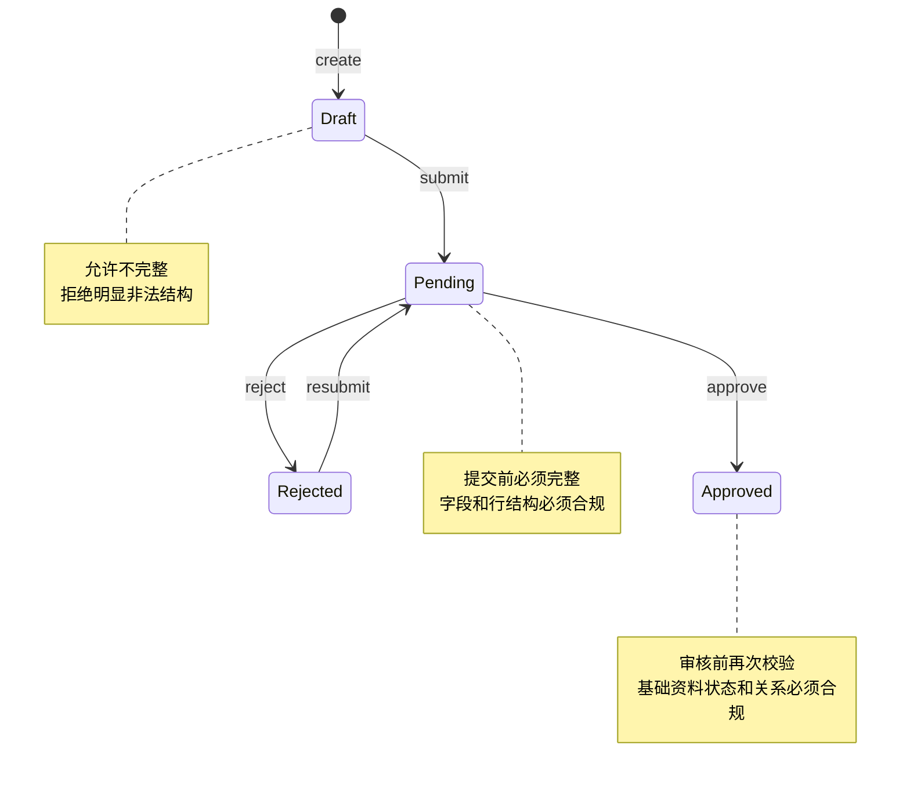
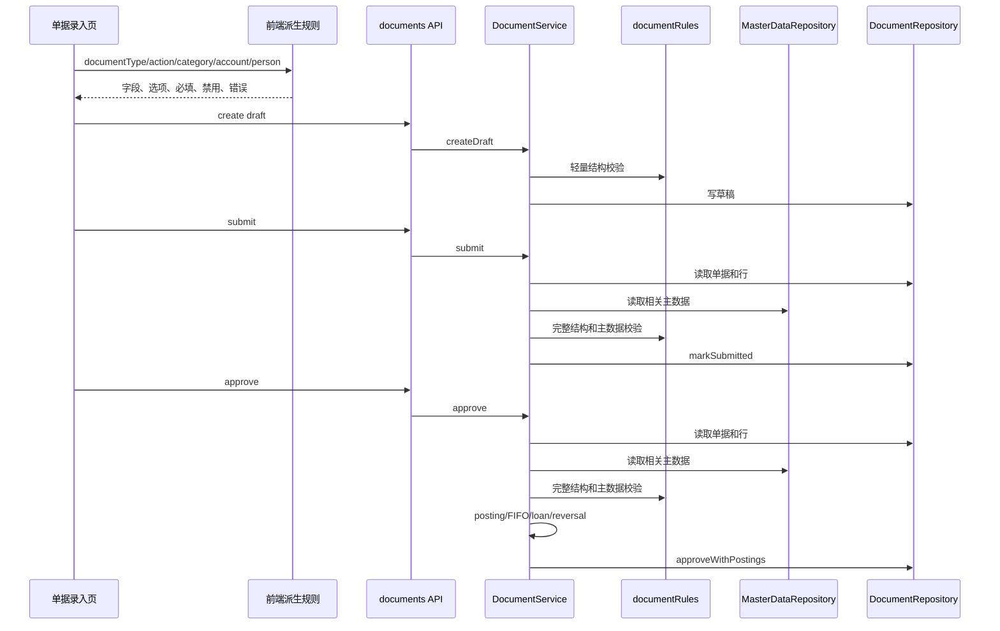

# 单据录入治理闭环设计方案

日期：2026-04-25

状态：已确认设计方向，作为实施计划依据。

## 1. 背景

系统已经完成基础资料治理中心，人员、项目、商户、账户、币种、管理科目可以集中维护，并且新增单据选项只读取 active/enabled 主数据。

但单据录入目前还没有形成完整闭环：

- 前端已经有部分联动规则，例如项目过滤商户、人员过滤备用金账户、账户锁定币种。
- 后端创建单据主要校验基础字段、日期、单据类型、创建人是否启用。
- 单据 header 和 line 上的项目、商户、账户、科目、币种、人员关系，仍缺少统一业务强校验。
- 数据库外键只能保证引用存在，不能保证引用处于可用状态，也不能保证类型匹配。

正式系统必须做到：前端只能让用户选合规项，后端仍然能拒绝绕过前端提交的错误数据。

## 2. 目标

本阶段目标是建设“单据录入治理闭环”，让业务单据在创建、提交、审核三个阶段都被同一套规则约束。

必须支持：

- 建立单据类型规则中心，明确每种单据类型需要哪些字段、哪些行字段、哪些基础资料类型。
- 保留草稿录入灵活性，允许保存未完成草稿。
- 提交时校验单据完整性，防止半成品进入待审核。
- 审核时校验基础资料状态和类型关系，防止历史脏草稿或绕过前端的数据被过账。
- 前端动态表单使用同一套规则口径，减少手写分支。
- 单据录入中的人员、项目、商户、账户、科目、币种、原单据继续全部来自受控选项。
- 错误提示能直接说明缺少字段或规则不匹配原因。

完成后，系统的数据入口会从“受控选择表单”升级为“规则驱动的正式录入工作台”。

## 3. 非目标

本阶段不做以下内容：

- 不支持 `manual_adjustment` 创建和审批。当前前端不暴露，后端 create 也不接受，posting 也未正式支持。
- 不做附件上传。
- 不做草稿编辑页面重构。
- 不做完整权限系统。
- 不改变审核过账生成余额、FIFO、借款、报表的核心算法。
- 不改变已经审核单据的历史数据。
- 不引入外部表单引擎或低代码框架。

## 4. 设计方案选择

### 方案 A：只加强前端表单

优点是体验提升快。缺点是后端仍可被绕过，测试覆盖也难以证明数据入口可靠。

### 方案 B：创建阶段立即强制完整单据

优点是数据从创建开始就干净。缺点是当前系统允许保存草稿，强制完整会破坏用户录入一半先保存的工作流。

### 方案 C：规则中心 + 提交/审核双闸口

创建阶段保留草稿灵活性；提交阶段做完整性校验；审核阶段做基础资料状态、类型、关系强校验。前端读取同一套规则口径，尽量在用户提交前提示问题。

采用方案 C。

理由：

- 不破坏现有草稿工作流。
- 审核过账前有最终安全闸口。
- 规则可以逐步扩展，不需要重写整个单据中心。
- 规则中心可独立测试，减少业务规则散落在 API、Service、React 组件中。

## 5. 现有边界

### 5.1 当前后端

现有链路：


已经存在的后端校验：

- `createdBy`、`actor`、`reviewer` 必须是启用人员。
- `documentType`、`actionType` 必须在允许集合中。
- `businessDate` 与 `period` 格式正确且月份一致。
- 冲正、借款还款、借款核销需要原单据。
- submit/approve/reject 有状态流转校验。
- approve 阶段已有 posting、FIFO、loan、reversal 领域校验。

缺口：

- 不校验项目是否 active。
- 不校验商户是否 active 且归属项目。
- 不校验账户是否 active、账户类型是否符合单据类型。
- 不校验币种是否 enabled。
- 不校验科目是否 enabled、类型和方向是否符合单据类型。
- 不校验科目 `requires_merchant`、`requires_person`、`requires_borrower`。
- 不校验人员备用金账户是否属于所选人员。
- 不校验借款还款和核销原单据是否与借款人、币种、原始借款关系一致。

### 5.2 当前前端

现有前端能力：

- `documentEntryModel.ts` 用 `baseFieldsByType` 控制各单据类型显示字段。
- `DocumentTypeFields.tsx` 根据 `getVisibleFieldKeys()` 渲染字段。
- 项目选择后过滤商户。
- 人员选择后过滤备用金账户。
- 账户选择后同步并锁定币种。
- 对方账户按单据类型、币种、人员过滤。
- 科目按单据类型过滤。
- 原单据按单据类型加载。

缺口：

- 科目上的 `requires_merchant`、`requires_person`、`requires_borrower` 尚未驱动字段显隐和必填。
- 缺少统一的派生状态对象，字段显示、必填、禁用、选项过滤分散在多个函数和组件里。
- 非法残留选择校验不完整，例如项目切换后的商户、账户变化后的对方账户、科目不再适用当前单据类型。

## 6. 核心设计

### 6.1 规则中心

新增纯领域规则模块：

`src/domain/documentRules.ts`

职责：

- 定义正式支持的单据类型。
- 定义每种单据类型的 header 字段规则。
- 定义每种单据类型的 line 字段规则。
- 定义账户角色要求，例如公司账户、人员备用金账户、USDT 账户。
- 定义科目类型和方向要求。
- 定义原单据要求。
- 输出可复用的校验结果。

规则中心不访问数据库。它只接收结构化输入和可选的主数据快照，然后返回错误列表。

核心接口方向：

```ts
export interface DocumentRuleViolation {
  field: string;
  message: string;
}

export interface DocumentRuleContext {
  documentType: DocumentType;
  actionType: ActionType;
  header: DocumentHeaderForValidation;
  lines: DocumentLineForValidation[];
}

export function validateDocumentStructure(context: DocumentRuleContext): DocumentRuleViolation[];
```

### 6.2 主数据强校验

新增服务层主数据校验边界，不把数据库查询写进规则中心。

推荐扩展：

- `src/repositories/masterDataRepository.ts`
  - 增加按 id/code 批量读取 people/projects/merchants/accounts/categories/currencies 的方法。
- `src/services/documentService.ts`
  - 在 submit 和 approve 阶段读取所需主数据。
  - 把主数据快照交给规则函数校验。

校验原则：

- 新单据只能使用 active/enabled 主数据。
- 历史已审核单据可以继续展示停用资料，但新的 submit/approve 不允许使用停用资料。
- 如果草稿引用的资料后来被停用，提交或审核时必须报错。

### 6.3 生命周期闸口



创建阶段：

- 继续允许 header-only draft。
- 如果传入 lines，则校验 line shape、金额格式、单据类型允许的字段。
- 继续校验创建人、日期、期间、action、原单据必填规则。

提交阶段：

- 必须存在完整 header 和 line。
- 必须满足单据类型结构规则。
- 不做余额影响。
- 如果校验失败，保持草稿或退回状态。

审核阶段：

- 再次执行结构规则。
- 执行主数据状态和类型关系强校验。
- 再进入现有 posting、FIFO、loan、reversal 校验。
- 审核失败不产生过账。

## 7. 单据类型规则矩阵

### 7.1 项目收入 `project_income`

要求：

- header 必填：`operatorPersonId`、`projectId`、`merchantId`、`categoryId`、`summary`
- line 必填：`accountId`、`currencyCode`、`amountMinor`
- line 可填：`usdtAmountMinor`

主数据规则：

- 项目必须 active。
- 商户必须 active，且 `merchant.project_id = projectId`。
- 科目必须 enabled，`category_type = income`，`direction = in`。
- 收款账户必须 active 且为公司账户。
- line 币种必须等于账户币种。

### 7.2 换汇 `exchange`

要求：

- header 必填：`operatorPersonId`、`categoryId`、`summary`
- line 必填：`accountId`、`counterpartyAccountId`、`currencyCode`、`amountMinor`、`usdtAmountMinor`

主数据规则：

- 科目必须 enabled，`category_type = exchange`。
- 转入账户和转出账户必须 active。
- 两个账户都必须是公司账户。
- `accountId` 为转入账户，line 币种必须等于转入账户币种。
- `counterpartyAccountId` 为转出账户，换汇转出账户必须能表达 USDT 成本来源。
- 转入账户和转出账户不能相同。

### 7.3 账户划转 `account_transfer`

要求：

- header 必填：`operatorPersonId`、`summary`
- line 必填：`accountId`、`counterpartyAccountId`、`currencyCode`、`amountMinor`

主数据规则：

- 转出账户和转入账户必须 active。
- 两个账户都必须是公司账户。
- 两个账户币种必须相同。
- line 币种必须等于账户币种。
- 转出账户和转入账户不能相同。

### 7.4 备用金发放 `petty_cash_issue`

要求：

- header 必填：`operatorPersonId`、`summary`
- line 必填：`accountId`、`counterpartyAccountId`、`personId`、`currencyCode`、`amountMinor`

主数据规则：

- `personId` 必须是 enabled 人员。
- `accountId` 为公司发放账户，必须 active 且为公司账户。
- `counterpartyAccountId` 为人员备用金账户，必须 active，`account_type = petty_cash`，`owner_person_id = personId`。
- 两个账户币种必须相同。
- line 币种必须等于账户币种。

### 7.5 备用金退回 `petty_cash_return`

要求：

- header 必填：`operatorPersonId`、`summary`
- line 必填：`accountId`、`counterpartyAccountId`、`personId`、`currencyCode`、`amountMinor`

主数据规则：

- `personId` 必须是 enabled 人员。
- `accountId` 为人员备用金账户，必须 active，`account_type = petty_cash`，`owner_person_id = personId`。
- `counterpartyAccountId` 为公司收回账户，必须 active 且为公司账户。
- 两个账户币种必须相同。
- line 币种必须等于账户币种。

### 7.6 备用金报销 `petty_cash_reimbursement`

要求：

- header 必填：`personId`、`categoryId`、`summary`
- header 条件必填：由科目决定 `projectId`、`merchantId`、`borrowerPersonId`
- line 必填：`accountId`、`currencyCode`、`amountMinor`

主数据规则：

- `personId` 必须是 enabled 人员。
- `accountId` 必须 active，`account_type = petty_cash`，`owner_person_id = personId`。
- 科目必须 enabled，`affects_expense_report = 1`，`direction = out`。
- 如果科目 `requires_merchant = 1`，则必须选择项目和商户，商户必须属于项目。
- 如果科目 `requires_person = 1`，则必须选择人员。
- 如果科目 `requires_borrower = 1`，则必须选择借款人。
- line 币种必须等于备用金账户币种。

### 7.7 借款发放 `loan_out`

要求：

- header 必填：`operatorPersonId`、`borrowerPersonId`、`categoryId`、`summary`
- line 必填：`accountId`、`currencyCode`、`amountMinor`、`usdtAmountMinor`

主数据规则：

- `borrowerPersonId` 必须是 enabled 人员。
- 账户必须 active 且为公司账户。
- 科目必须 enabled，`category_type = loan`。
- line 币种必须等于账户币种。

### 7.8 借款还款 `loan_repayment`

要求：

- header 必填：`operatorPersonId`、`borrowerPersonId`、`originalDocumentId`、`summary`
- line 必填：`accountId`、`currencyCode`、`amountMinor`

主数据规则：

- 原单据必须是 approved `loan_out`。
- `borrowerPersonId` 必须与可还款借款人一致。
- 账户必须 active 且为公司账户。
- line 币种必须等于账户币种。
- 还款币种必须与可还款借款项匹配。

### 7.9 借款核销 `loan_writeoff`

要求：

- header 必填：`operatorPersonId`、`borrowerPersonId`、`categoryId`、`originalDocumentId`、`summary`
- line 必填：`currencyCode`、`amountMinor`
- line 不需要 `accountId`

主数据规则：

- 原单据必须是 approved `loan_out`。
- `borrowerPersonId` 必须与待核销借款人一致。
- 科目必须 enabled，`category_type` 为 `expense` 或 `loss`，`direction = out`。
- 核销币种必须与待核销借款项匹配。

### 7.10 冲正 `reversal`

要求：

- header 必填：`originalDocumentId`、`summary`
- 不要求新业务 line。

主数据规则：

- 原单据必须 approved。
- 冲正单据类型必须与原单据类型一致。
- 原单据不能已经存在 approved 冲正单。
- 冲正沿用原单据影响，不重新要求 active/enabled 主数据。

## 8. 前端设计

前端不重写单据页面，只把当前分散规则整理成派生状态。

推荐新增：

`src/app/pages/documents/documentEntryRules.ts`

职责：

- 包装 `getVisibleFieldKeys`、必填字段、禁用字段、选项过滤。
- 根据已选科目动态追加 `merchantId`、`personId`、`borrowerPersonId` 要求。
- 返回字段选项集合，供 `DocumentTypeFields.tsx` 渲染。
- 返回非法残留选择，例如商户不属于项目、账户不在当前账户池。

派生结果示例：

```ts
export interface DocumentEntryState {
  visibleFields: DocumentFieldKey[];
  requiredFields: DocumentFieldKey[];
  disabledFields: DocumentFieldKey[];
  optionsByField: Partial<Record<DocumentFieldKey, unknown[]>>;
  validationErrors: string[];
}
```

UI 规则：

- 继续复用 `SelectField`。
- 主数据类字段全部用选择器。
- 金额、USDT 成本、摘要、日期、期间保留输入框。
- 账户选定后币种保持禁用。
- 依赖未满足时禁用下游字段，并显示明确提示。
- 项目变化清空商户。
- 人员变化清空备用金账户和对方账户。
- 主账户变化清空对方账户并同步币种。

## 9. 后端设计

### 9.1 新增领域规则模块

`src/domain/documentRules.ts`

包含：

- `SUPPORTED_DOCUMENT_TYPES`
- `DOCUMENT_RULES`
- `validateDocumentStructure`
- `validateDocumentMasterData`
- `isOriginalRequiredForDocument`
- `requiredHeaderFieldsFor`
- `requiredLineFieldsFor`

### 9.2 扩展 MasterDataRepository

`src/repositories/masterDataRepository.ts`

新增读取方法：

- `getPeopleByIds(ids: string[])`
- `getProjectsByIds(ids: string[])`
- `getMerchantsByIds(ids: string[])`
- `getAccountsByIds(ids: string[])`
- `getCategoriesByIds(ids: string[])`
- `getCurrenciesByCodes(codes: string[])`

这些方法返回当前表状态，不过滤 active/enabled。是否允许使用由规则层判断。

### 9.3 接入 DocumentService

`src/services/documentService.ts`

接入点：

- `createDraft`
  - 继续支持不完整草稿。
  - 如果传入 lines，则执行轻量结构校验。
- `submit`
  - 读取单据和 lines。
  - 执行完整结构校验。
  - 执行主数据强校验。
  - 通过后才 markSubmitted。
- `approve`
  - 在 posting/FIFO/loan 之前执行完整结构和主数据强校验。
  - 冲正单走冲正规则，不要求原主数据仍 active。

## 10. 数据流



## 11. 错误提示

错误提示要面向录入用户，不暴露 SQL 或内部函数名。

示例：

| 场景 | 错误 |
| --- | --- |
| 项目收入缺商户 | `项目收入必须选择商户` |
| 商户不属于项目 | `商户必须属于所选项目` |
| 账户币种不一致 | `币种必须与账户币种一致` |
| 停用账户 | `账户必须是启用状态` |
| 科目类型不匹配 | `科目类型不适用于当前单据类型` |
| 科目要求商户但未选择 | `该科目要求选择商户` |
| 备用金账户人员不匹配 | `备用金账户必须属于所选人员` |
| 借款还款原单据错误 | `借款还款必须关联已审核借款发放单` |

## 12. 测试策略

### 12.1 领域规则测试

新增：

`tests/domain/documentRules.test.ts`

覆盖：

- 每种单据类型的必填 header 字段。
- 每种单据类型的必填 line 字段。
- 冲正规则。
- 科目 requires flags。
- 账户类型和币种匹配。
- 原单据要求。

### 12.2 Service 测试

扩展：

`tests/api/documentService.test.ts`

覆盖：

- 草稿可以不完整保存。
- submit 拒绝不完整草稿。
- submit 拒绝停用主数据。
- approve 在 posting 前拒绝停用或不匹配主数据。
- 冲正不要求原主数据仍 active。

### 12.3 API 测试

扩展：

`tests/api/documents.test.ts`

覆盖：

- create 仍允许 header-only draft。
- create 拒绝明显非法 line。
- submit 返回业务规则 400。
- approve 返回业务规则 400。

### 12.4 前端模型测试

扩展：

`src/app/pages/documents/documentEntryModel.test.ts`

覆盖：

- 派生字段显隐。
- 科目 requires flags 动态要求字段。
- 项目过滤商户。
- 人员过滤备用金账户。
- 账户同步币种。
- 非法残留选择报错。

## 13. 验收标准

本阶段完成后应满足：

- 草稿可以保存不完整内容。
- 不完整草稿不能提交。
- 绕过前端提交的错误项目、商户、账户、科目、币种、人员关系会被后端拒绝。
- 审核前再次校验主数据状态和关系。
- 项目收入、换汇、账户划转、备用金发放、备用金退回、备用金报销、借款发放、借款还款、借款核销都有明确规则。
- 前端单据录入字段、必填、禁用、选项来自派生规则。
- 已停用基础资料不出现在新增选项中，历史单据仍可展示。
- `manual_adjustment` 在本阶段保持不可创建。
- 全量测试、类型检查、构建通过。

## 14. 实施顺序

推荐分阶段实施：

1. 新增纯 `documentRules` 和领域单测。
2. 扩展 `MasterDataRepository` 批量读取能力。
3. 在 `DocumentService.submit` 接入完整性和主数据校验。
4. 在 `DocumentService.approve` 接入相同校验。
5. 抽前端 `documentEntryRules` 派生状态。
6. 改造 `DocumentTypeFields` 消费派生状态。
7. 补 API 和浏览器烟测。
8. 做规格复核和代码质量复核。

## 15. 风险与约束

| 风险 | 处理 |
| --- | --- |
| 破坏草稿保存 | create 阶段保留宽松，submit/approve 做强校验。 |
| 规则重复 | 前端派生规则和后端领域规则保持同名概念，用测试覆盖关键矩阵。 |
| 审批逻辑复杂 | 在 posting/FIFO/loan 前加校验，不改过账算法。 |
| 历史脏草稿 | submit/approve 阶段拦截并给出可修复错误。 |
| 类型边界混乱 | `manual_adjustment` 本阶段保持不可创建。 |

