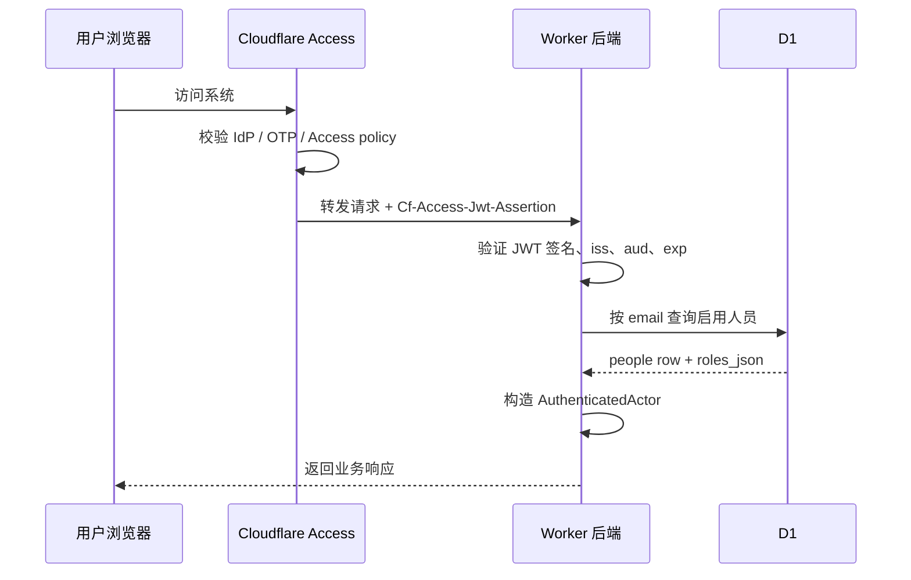
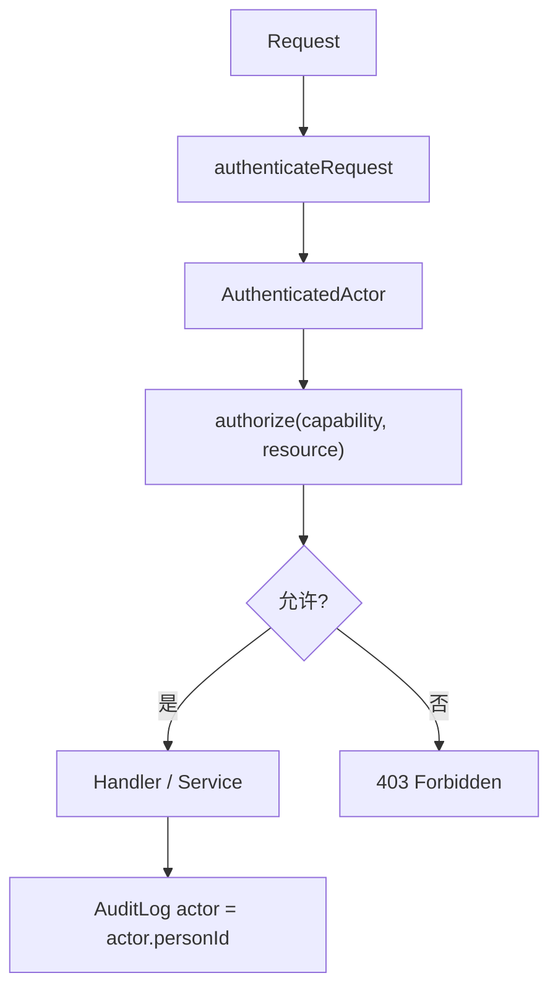
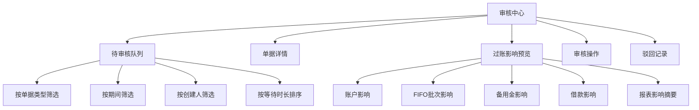
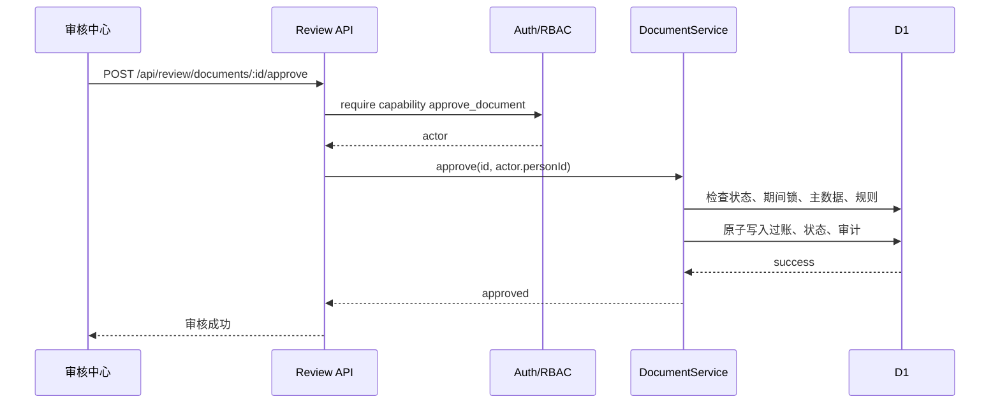
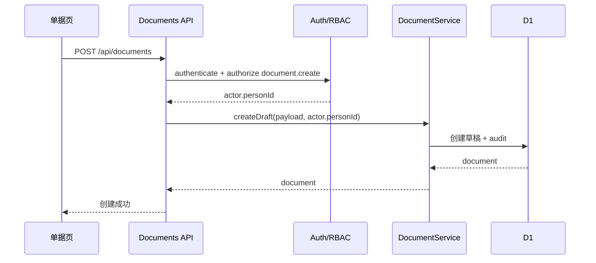
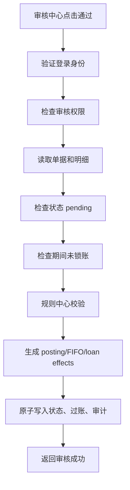

# 身份权限与审核中心设计方案

日期：2026-04-25

状态：待业务确认，作为后续实施计划依据。

## 1. 背景

系统已经完成正式单据、审核过账、基础资料治理、单据录入受控选项、提交/审核规则闸口、FIFO、备用金、借款和报表第一批能力。

当前剩余的核心问题是：系统还没有可信身份边界。

现状：

- 页面顶部的“当前操作人”由用户手动选择。
- `people.roles_json` 已经保存人员角色，但还没有形成统一授权服务。
- 创建、提交、审核、驳回已经写入 `people.id`，但仍可由前端选择任意启用人员。
- `period_locks` 已有后端表和审核防线，但没有正式锁账/解锁入口。
- 审核操作仍混在业务单据列表中，没有独立审核中心。

正式内部系统必须做到：用户先通过 Cloudflare Access 进入系统，系统再根据内部人员主数据和角色决定能看什么、能做什么。审计日志必须记录真实登录身份，而不是用户在页面上手动选择的身份。

## 2. 目标

本阶段目标是建设“可信身份 + 内部角色权限 + 正式审核中心”的设计边界。

必须支持：

- 使用 Cloudflare Access 保护生产系统入口。
- Worker 后端验证 Cloudflare Access JWT，不能只相信可伪造的普通请求头。
- 将 Access 身份中的 email 映射到 `people` 主数据。
- 只有启用人员可以进入系统业务功能。
- 使用 `people.roles_json` 做内部 RBAC 授权。
- 移除生产环境的“当前操作人冒充”能力。
- 创建、提交、审核、驳回、锁账、解锁、基础资料维护都使用真实登录人员作为 actor。
- 建设审核中心，集中处理待审核、驳回、过账预览和审核结果。
- 建设锁账/月结入口，使用现有 `period_locks` 作为正式期间控制。
- 保持当前单据治理、过账、报表、基础资料能力不被破坏。

完成后，系统从“有审计字段的内部工具”升级为“身份可信、权限清晰、审核集中、期间可控的正式管理会计系统”。

## 3. 非目标

本阶段不做以下内容：

- 不自建用户名密码登录系统。
- 不实现复杂组织架构、部门层级、项目级数据权限。
- 不做多级审批流。
- 不做移动端审批。
- 不做 SSO IdP 管理后台。
- 不做附件上传、导入、导出水印。
- 不改变已审核单据的过账算法。
- 不改变报表计算口径。
- 不支持用户直接修改账户余额、备用金余额、借款余额或报表数字。

## 4. 设计方案选择

### 方案 A：只用 Cloudflare Access 控制入口

Cloudflare Access 负责谁能打开系统，系统内部继续保留“当前操作人”选择器。

优点是改动小。缺点是系统内部审计仍不可信，进入系统的人仍可选择任意人员提交或审核单据。

不采用。

### 方案 B：自建完整登录、用户、角色、会话系统

系统自己管理登录密码、会话、角色、重置密码、MFA。

优点是控制力强。缺点是安全复杂度高，与当前 Cloudflare 部署环境不匹配，而且重复建设 Cloudflare Access 已经提供的入口认证能力。

不采用。

### 方案 C：Cloudflare Access 认证 + 系统内部 RBAC 授权

Cloudflare Access 只负责入口认证和身份声明；Worker 验证 Access JWT 并提取登录 email；系统用 email 映射到 `people`；业务操作由内部角色权限决定。

采用方案 C。

理由：

- 符合当前 Cloudflare 部署环境。
- 不自建密码体系，降低安全面。
- 保留系统内部业务角色，满足管理会计权限要求。
- 审计 actor 可以稳定落到真实人员。
- 后续可以在同一边界上扩展项目级权限和多级审批。

## 5. Cloudflare Access 边界

Cloudflare Access 是入口身份层，不是业务授权层。

生产环境必须配置：

- 将部署域名作为 Cloudflare Access self-hosted application 保护。
- Access policy 只允许内部邮箱或指定 IdP 用户进入。
- Worker 配置 Access Application Audience (`AUD`) 和 team domain。
- 后端验证请求中的 Access JWT。

后端必须验证：

- 请求包含 `Cf-Access-Jwt-Assertion`。
- JWT 签名来自 Cloudflare Access 公钥。
- `iss` 匹配 Cloudflare Access team domain。
- `aud` 包含当前应用 AUD。
- token 未过期。
- payload 中的 email 存在且格式正常。

不能做：

- 不能只读取 `cf-access-authenticated-user-email` 或其他普通 email header 作为最终身份。
- 不能让前端传 `actor` 决定真实操作者。
- 不能在生产环境启用任意人员选择作为审计 actor。

官方依据：

- Cloudflare Access 会给 origin 请求加入 `Cf-Access-Jwt-Assertion`，官方建议验证该 header 而不是只依赖 cookie。
- Access JWT 需要用 team domain 的 JWKs 和应用 AUD 校验。
- Access self-hosted application 默认拒绝访问，用户必须匹配 Allow policy 才能进入。

参考：

- https://developers.cloudflare.com/cloudflare-one/identity/authorization-cookie/validating-json/
- https://developers.cloudflare.com/cloudflare-one/identity/authorization-cookie/application-token/
- https://developers.cloudflare.com/cloudflare-one/applications/
- https://developers.cloudflare.com/cloudflare-one/policies/access/

## 6. 身份模型

### 6.1 登录身份

新增后端身份对象：

```ts
interface AuthenticatedIdentity {
  email: string;
  accessSubject: string | null;
  accessIssuer: string;
  accessAudience: string[];
}
```

身份来源：



### 6.2 人员映射

`people` 是系统内部身份和业务人员的统一主数据。

建议扩展字段：

| 字段 | 说明 |
| --- | --- |
| `login_email` | Cloudflare Access email，唯一，可为空。 |
| `access_subject` | Access/IdP subject，可为空，用于辅助审计。 |
| `last_login_at` | 最近一次成功映射时间。 |

映射规则：

- Access email 必须映射到一条 `people`。
- `people.is_enabled = 1` 才能进入业务功能。
- 一个 email 只能绑定一个人员。
- 未绑定 email 的人员仍可作为业务经办人、报销人、借款人，但不能作为登录用户。
- 停用人员不能登录、不能创建、提交、审核、驳回或维护基础资料。

本阶段不强制把所有业务人员都绑定登录邮箱。后勤报销人、借款人可以只是业务人员。

### 6.3 当前操作人替代

生产环境：

- 页面不再允许用户选择“当前操作人”作为系统 actor。
- 页面顶部展示“当前登录人：姓名 / 邮箱 / 角色”。
- 创建、提交、审核、驳回、基础资料写操作都由后端使用登录人员决定 actor。

本地开发环境：

- 允许配置 `DEV_ACTOR_EMAIL` 或开发模式 header。
- 该绕过只在 `ENVIRONMENT=local` 或明确开发 flag 下启用。
- 测试必须覆盖生产环境不接受前端 actor 冒充。

## 7. 角色权限模型

复用现有 `people.roles_json`。

正式角色：

| 角色 | 说明 |
| --- | --- |
| `admin` | 系统最高权限，维护人员、角色、锁账、解锁、高风险配置。 |
| `finance_manager` | 财务主管，审核、驳回、锁账、查看全部报表、发起冲正。 |
| `finance_entry` | 财务录入，创建草稿、编辑草稿、提交审核。 |
| `logistics` | 后勤人员，提交本人备用金报销、查看本人备用金状态。 |
| `readonly` | 只读/管理层，查看报表和异常，不允许写入。 |
| `borrower` | 借款业务对象，可被选择为借款人；默认不代表可登录操作。 |

权限以能力点表达，不在业务代码里散落判断。

建议能力点：

| 能力 | admin | finance_manager | finance_entry | logistics | readonly |
| --- | --- | --- | --- | --- | --- |
| 查看工作台 | 是 | 是 | 是 | 是 | 是 |
| 查看报表 | 是 | 是 | 可限制 | 本人相关 | 是 |
| 创建普通业务草稿 | 是 | 是 | 是 | 部分 | 否 |
| 编辑草稿 | 是 | 是 | 本人创建 | 本人创建 | 否 |
| 提交审核 | 是 | 是 | 是 | 本人创建 | 否 |
| 审核通过 | 是 | 是 | 否 | 否 | 否 |
| 驳回单据 | 是 | 是 | 否 | 否 | 否 |
| 发起冲正 | 是 | 是 | 可申请 | 否 | 否 |
| 基础资料维护 | 是 | 可配置 | 否 | 否 | 否 |
| 锁账 | 是 | 是 | 否 | 否 | 否 |
| 解锁 | 是 | 否或二次确认 | 否 | 否 | 否 |
| 维护人员角色 | 是 | 否 | 否 | 否 | 否 |

初期建议：

- `admin` 和 `finance_manager` 可审核。
- `admin` 可维护人员角色。
- `finance_manager` 可维护业务基础资料，但不能给自己或别人加管理员。
- `readonly` 所有写接口返回 403。
- `borrower` 只作为业务标签，不自动授予系统操作权限。

## 8. 授权架构

新增授权边界：



建议模块：

| 模块 | 职责 |
| --- | --- |
| `src/auth/access.ts` | 验证 Cloudflare Access JWT，提取 email。 |
| `src/auth/actor.ts` | email 映射到启用人员和角色。 |
| `src/auth/permissions.ts` | 定义 capability、角色矩阵、资源级规则。 |
| `src/worker/authContext.ts` | 给每个 API handler 注入 actor。 |

Handler 不再从 request body 读取 `createdBy`、`actor`、`reviewer` 作为真实操作者。

过渡期 API 策略：

- 新接口使用后端 actor。
- 旧 request body 中的 `createdBy`、`actor`、`reviewer` 可暂时保留兼容测试，但生产环境忽略或要求与登录人员一致。
- 如果 body actor 与登录人员不一致，返回 400 或 403，并记录安全审计。

## 9. 审核中心

### 9.1 目标

审核中心把“待审核处理”从单据列表里的按钮升级为正式业务工作台。

核心问题：

- 哪些单据待我审核？
- 单据是否完整、是否会过账成功？
- 审核通过会影响哪些账户、批次、备用金、借款和报表？
- 驳回原因是什么？
- 哪些单据长期停留在待审核？

### 9.2 页面结构



### 9.3 待审核队列

字段：

| 字段 | 说明 |
| --- | --- |
| 单据号 | `document_no` |
| 类型 | `document_type` |
| 业务日期 | `business_date` |
| 期间 | `period` |
| 创建人 | `created_by` 映射人员 |
| 经办人 | `operator_person_id` 映射人员 |
| 项目 | 项目单据显示 |
| 商户 | 项目收入显示 |
| 金额 | 主明细金额 |
| 等待时长 | 当前时间 - `submitted_at` |
| 风险提示 | 锁账、规则错误、主数据停用、复杂冲正 |

队列只展示当前用户有权审核的单据。

初期权限：

- `admin`、`finance_manager` 查看全部待审核。
- 其他角色不能看到审核按钮。

### 9.4 单据详情

详情页不允许在审核状态直接修改单据。

展示：

- header 字段。
- 明细行。
- 原单据链接。
- 主数据名称和状态。
- 创建、提交、审核、驳回审计链。
- 规则校验结果。

如果单据提交后主数据被停用，详情中明确提示“审核不可通过，需退回修改或重新启用主数据”。

### 9.5 过账影响预览

审核前提供只读预览，不写入业务表。

预览内容：

| 单据类型 | 预览 |
| --- | --- |
| 项目收入 | 账户增加、项目/商户收入增加、USDT 金额。 |
| 换汇 | USDT 账户减少、目标币种储备增加、生成批次。 |
| 账户划转 | 转出/转入账户变化、FIFO 批次移动。 |
| 备用金发放 | 储备账户减少、人员备用金账户增加、批次移动。 |
| 备用金退回 | 人员备用金减少、公司账户增加。 |
| 备用金报销 | 人员备用金减少、费用入账、FIFO 成本匹配或待匹配。 |
| 借款发放 | 账户减少、借款本金增加。 |
| 借款还款 | 账户增加、借款余额减少。 |
| 借款核销 | 借款余额减少、损失/费用增加。 |
| 冲正 | 展示原单据反向影响；复杂冲正展示阻断原因。 |

技术原则：

- 预览复用现有 posting/FIFO/loan planning 逻辑。
- 预览不写入 `account_entries`、`lots`、`loan_entries` 或 audit。
- 预览失败不改变单据状态。

### 9.6 审核通过

审核通过流程：



审核失败：

- 返回 400：业务规则不满足，例如主数据停用、币种不匹配、原单据错误。
- 返回 403：当前用户无审核权限。
- 返回 409：单据状态已变化或期间被锁。

### 9.7 驳回

驳回必须填写原因。

规则：

- 只有有审核权限的人可以驳回。
- 驳回后单据状态为 `rejected`。
- 驳回原因写入 `documents.reject_reason` 和 audit。
- 创建人或有权限录入人员可修改后重新提交。

## 10. 锁账/月结

现有 `period_locks` 表：

| 字段 | 说明 |
| --- | --- |
| `period` | 锁定期间，格式 `YYYY-MM`。 |
| `locked_by` | 锁账人员。 |
| `locked_at` | 锁账时间。 |
| `note` | 备注。 |

本阶段建设正式入口：

- 查看所有期间锁账状态。
- 锁定某期间。
- 解锁某期间。
- 锁账/解锁必须写 audit。
- 解锁必须填写原因。

权限：

- `admin` 可锁账和解锁。
- `finance_manager` 可锁账。
- `finance_manager` 解锁建议初期不开放，后续可做二次确认。

锁账影响：

- 已锁期间不能审核通过。
- 已锁期间不能普通修改草稿或重新提交。
- 冲正单按冲正业务日期检查锁账；复杂规则后续单独设计。

## 11. 审计增强

当前 `audit_logs.actor` 是文本。短期可继续保存 `people.id`，但要规范来源为真实登录人员。

建议增强：

| 字段 | 说明 |
| --- | --- |
| `actor_person_id` | 登录人员 ID。 |
| `actor_email` | Access email。 |
| `request_id` | 请求 ID，便于追踪。 |
| `ip_address` | 请求 IP，来自可信平台信息。 |
| `user_agent` | 浏览器 UA。 |

过渡策略：

- 第一阶段仍写 `actor = people.id`。
- 同步新增可选字段保存 email 和 request 信息。
- 后续报表和审计页面优先展示人员名称和 email。

必须审计：

- 登录人员首次映射成功。
- 未绑定 email 访问被拒绝。
- 停用人员访问被拒绝。
- 权限不足访问被拒绝。
- 创建、提交、审核、驳回。
- 基础资料创建、修改、停用、归档。
- 锁账、解锁。
- 冲正审核。

## 12. API 设计

### 12.1 身份接口

`GET /api/me`

返回：

```json
{
  "data": {
    "person": {
      "id": "person_1",
      "name": "Alice",
      "alias": "alice",
      "loginEmail": "alice@example.com",
      "roles": ["finance_manager"]
    },
    "capabilities": ["document.approve", "document.reject", "reports.view"]
  }
}
```

用途：

- 前端展示当前登录人。
- 前端按 capability 隐藏不可用入口。
- 后端仍必须在每个写接口重新授权。

### 12.2 审核中心接口

| 接口 | 说明 |
| --- | --- |
| `GET /api/review/documents` | 待审核队列。 |
| `GET /api/review/documents/:id` | 审核详情。 |
| `GET /api/review/documents/:id/preview` | 过账影响预览。 |
| `POST /api/review/documents/:id/approve` | 审核通过。 |
| `POST /api/review/documents/:id/reject` | 驳回。 |

### 12.3 锁账接口

| 接口 | 说明 |
| --- | --- |
| `GET /api/period-locks` | 查看锁账列表。 |
| `POST /api/period-locks` | 锁定期间。 |
| `DELETE /api/period-locks/:period` | 解锁期间。 |

解锁请求必须包含 reason。

### 12.4 兼容旧单据接口

现有：

- `POST /api/documents`
- `POST /api/documents/:id/submit`
- `POST /api/documents/:id/approve`
- `POST /api/documents/:id/reject`

建议：

- 保留路径，避免一次性重写前端。
- 内部改为使用认证 actor。
- 审核中心新接口可以调用同一 service。
- 旧 approve/reject 路径后续可隐藏在前端，不再作为正式入口。

## 13. 前端设计

### 13.1 顶部身份区

替换“当前操作人”选择器。

展示：

- 当前登录人姓名。
- 邮箱。
- 角色。
- 无权限提示。

如果 `/api/me` 返回 401/403：

- 显示“当前邮箱未绑定启用人员，请联系管理员”。
- 不展示业务写操作。

### 13.2 导航

建议新增：

- 工作台
- 业务单据
- 审核中心
- 报表中心
- 基础资料
- 系统设置

权限隐藏：

- 无审核权限不显示审核中心。
- 无基础资料维护权限时，基础资料页只读或不显示写按钮。
- 无锁账权限不显示锁账入口。

### 13.3 审核中心页面

布局：


交互：

- 点击队列行加载详情。
- 详情加载后自动请求预览。
- 预览失败时禁用通过按钮，只允许驳回。
- 驳回弹出原因输入。
- 审核通过需要确认弹窗，说明这是正式过账。

### 13.4 业务单据页调整

业务单据页继续负责创建草稿和查看列表。

调整：

- 创建草稿不再传 `createdBy`，或只在本地开发传。
- 提交不再传 `actor`，由后端决定。
- 不在列表中显示审核通过按钮，或仅保留给有审核权限的人作为快捷入口。
- 单据状态和错误提示保留。

## 14. 错误处理

统一错误：

| 状态 | 场景 |
| --- | --- |
| 401 | 缺少或无法验证 Access JWT。 |
| 403 | 登录人员未绑定、停用或权限不足。 |
| 400 | 业务数据不合法。 |
| 409 | 状态冲突、期间锁定、重复操作。 |
| 500 | 未预期系统错误。 |

用户可见提示：

- “当前登录邮箱未绑定系统人员，请联系管理员。”
- “当前人员已停用，不能操作系统。”
- “你没有审核单据的权限。”
- “期间 2026-04 已锁账，不能审核通过。”
- “该单据已被其他人处理，请刷新。”

## 15. 安全规则

- 所有写接口必须有认证 actor。
- 所有写接口必须调用授权检查。
- 前端 capability 只用于体验，不能作为安全依据。
- 生产环境不接受前端传入的真实 actor。
- 审核、驳回、锁账、解锁必须写 audit。
- Access JWT 验证失败时不能降级为匿名用户。
- 本地开发绕过必须被环境变量显式控制，不能在生产开启。
- 服务 token 或自动化调用后续单独设计，不混入人员身份。

## 16. 数据流

### 16.1 创建草稿



### 16.2 审核过账



## 17. 测试策略

### 17.1 单元测试

- Access JWT 验证：缺 token、无效 aud、无效 issuer、过期 token。
- email 映射：未绑定、停用、启用、重复绑定。
- RBAC：每个角色的核心 capability。
- 授权资源规则：只读不能写，后勤只能本人相关操作。

### 17.2 API 测试

- 无身份访问写接口返回 401。
- 未绑定人员返回 403。
- 停用人员返回 403。
- `finance_entry` 可以创建和提交，不能审核。
- `finance_manager` 可以审核和驳回。
- `readonly` 不能创建、提交、审核、维护基础资料。
- body 中传入别人 actor 不会改变真实操作者。
- 锁账后审核返回 409 或业务错误。

### 17.3 前端测试

- `/api/me` 成功后展示登录人员。
- 不同 capability 下导航和按钮显示正确。
- 审核中心队列、详情、预览、通过、驳回状态正确。
- 预览失败禁用通过按钮。
- 403 显示明确无权限提示。

### 17.4 浏览器冒烟

- 未登录访问被 Cloudflare Access 拦截。
- 已登录未绑定邮箱看到联系管理员提示。
- 财务录入可以创建并提交草稿。
- 财务录入看不到审核按钮。
- 财务主管可以在审核中心通过单据。
- 只读用户只能查看报表。
- 锁账后对应期间单据不能审核。

## 18. 分阶段交付

### 阶段 1：认证上下文

- 增加 Access JWT 验证模块。
- 增加 `/api/me`。
- 增加 `people.login_email`。
- 后端能把请求映射为 `AuthenticatedActor`。
- 本地开发提供受控 dev actor。

### 阶段 2：RBAC 授权

- 定义 capability 矩阵。
- 写接口接入授权检查。
- 旧 actor body 改为兼容但不可信。
- 更新审计 actor 来源。

### 阶段 3：审核中心 API

- 待审核队列。
- 审核详情。
- 过账影响预览。
- approve/reject 专用审核接口。

### 阶段 4：审核中心前端

- 顶部登录人展示。
- 审核中心页面。
- 业务单据页移除生产 actor 选择。
- 权限驱动导航和按钮。

### 阶段 5：锁账/月结入口

- 锁账列表。
- 锁账操作。
- 解锁操作和原因。
- 审计记录。

## 19. 验收标准

本阶段完成后应满足：

- 生产写接口不能被前端伪造 actor。
- 只有绑定启用人员的 Access 登录用户能使用业务功能。
- 权限不足时返回 403，不产生业务写入。
- 审核通过只能由 `admin` 或 `finance_manager` 执行。
- 审核中心能展示待审核队列、详情和过账预览。
- 审核通过仍沿用现有正式过账逻辑。
- 锁账入口能锁定期间，并阻止对应期间审核。
- 全量测试、类型检查和构建通过。
- 当前报表口径不变。

## 20. 风险和处理

| 风险 | 处理 |
| --- | --- |
| Access header 被伪造 | 后端验证 JWT 签名、issuer、aud，不信任普通 email header。 |
| 登录邮箱未绑定人员 | 返回 403，提示联系管理员绑定。 |
| 角色配置错误导致无人可管理 | seed 或迁移保留至少一个 admin，管理员角色修改需谨慎。 |
| 本地开发不方便 | 提供显式 dev actor，生产禁止。 |
| 审核中心预览和实际过账不一致 | 预览必须复用同一套 planning 逻辑，不能另写算法。 |
| 权限判断散落 | 所有能力点集中在 `permissions.ts`。 |
| 一次性改动过大 | 按 5 个阶段拆分，每阶段独立测试和合并。 |

## 21. 后续计划

本设计确认后，下一步写实施计划：

`docs/superpowers/plans/2026-04-25-identity-permissions-review-center.md`

实施建议继续使用 Subagent-Driven：

- 认证上下文和 `/api/me`。
- RBAC 授权和 API 改造。
- 审核中心 API 和预览。
- 审核中心前端。
- 锁账/月结入口。
- 端到端验证和安全审查。
