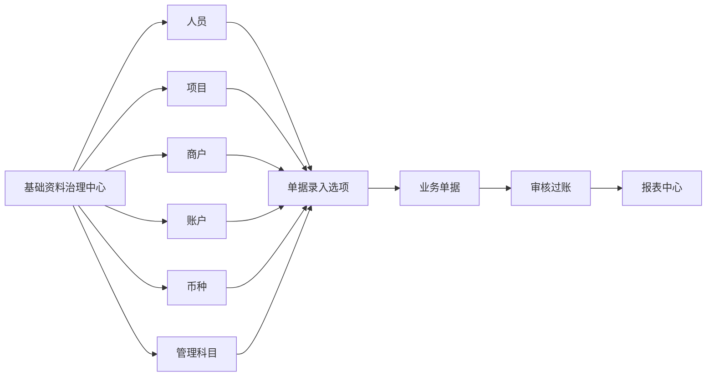
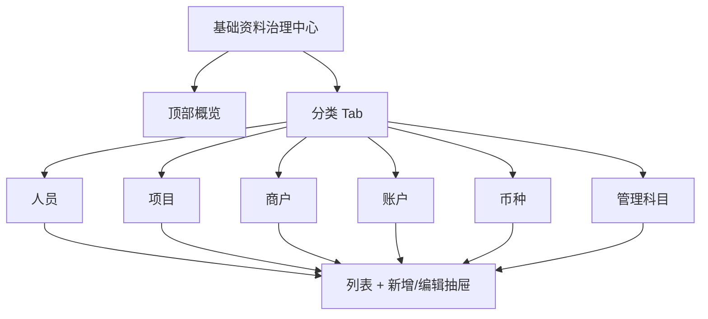
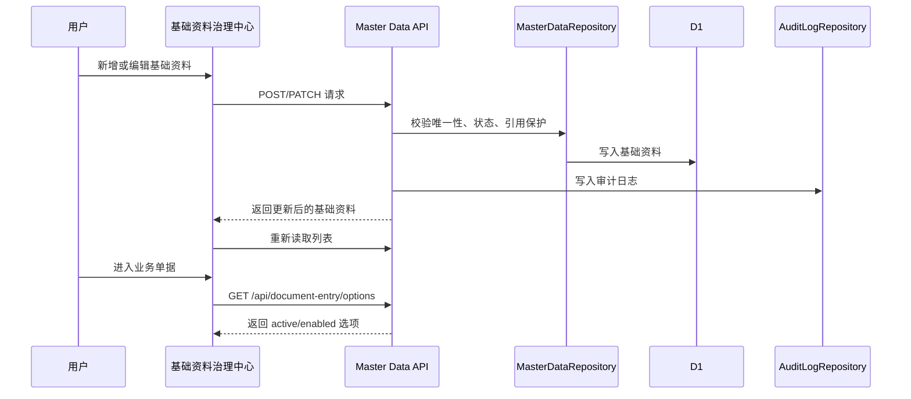

# 基础资料治理中心设计方案

## 1. 背景

当前系统已经把业务单据录入从手填 ID 改为受控选择。单据创建、提交、审核、驳回也开始要求操作者来自启用人员主数据。

这让基础资料从“辅助数据”变成正式系统的前置约束：

- 人员不存在或停用时，不能创建、提交、审核、驳回单据。
- 项目、商户、账户、科目、币种不规范时，单据录入会被阻断或影响报表口径。
- 单据只能选择 active/enabled 主数据，历史单据仍要保留已保存值。

当前基础资料页面仍是 MVP：只展示币种，并只能创建项目。下一阶段应建设“基础资料治理中心”，让正式系统可以维护单据录入依赖的主数据。

## 2. 目标

本阶段目标是把基础资料从测试页升级为正式维护中心。

必须支持：

- 人员、项目、商户、账户、科目、币种的统一查看。
- 创建和编辑常用基础资料。
- 启用、停用或归档基础资料，而不是删除已引用数据。
- 基础资料被单据引用后，禁止破坏历史口径的修改。
- 单据录入选项与基础资料维护结果保持一致。
- 关键操作进入审计日志。

本阶段完成后，用户可以先维护基础资料，再进入业务单据中心录入正式单据。

## 3. 非目标

本阶段不做以下内容：

- 不做登录系统和 Cloudflare Access 集成。
- 不做完整角色权限引擎，只保留后续角色字段和审计基础。
- 不做批量 Excel 导入。
- 不做物理删除。
- 不直接修改账户余额、备用金余额、借款余额或报表数据。
- 不重做单据中心、报表中心或审核过账逻辑。

## 4. 设计方案选择

### 方案 A：继续在现有页面上追加表单

优点是改动最小。缺点是页面会快速变成混杂表单，人员、项目、账户、科目的规则难以看清，也不适合作为正式系统长期维护入口。

### 方案 B：直接做完整后台管理系统

优点是功能完整，可以一次性包含权限、批量导入、删除、历史版本、复杂搜索。缺点是范围过大，会拖慢当前正式台账主线，而且很多权限规则还需要真实使用后再定。

### 方案 C：建设聚焦的基础资料治理中心

把基础资料拆成独立 tab，每个 tab 提供列表、创建、编辑、启停和引用保护。先覆盖单据录入必需的数据，不引入过重的后台框架。

采用方案 C。

理由：

- 与当前系统结构一致，能在现有 Cloudflare Worker + React 架构内递进。
- 直接解决单据录入依赖的主数据质量问题。
- 后续可以在同一 API 和 UI 边界上接入权限、导入、版本记录。

## 5. 模块边界

基础资料治理中心只负责“可选择的数据”和“业务分类规则”。



边界规则：

- 基础资料可以影响后续单据可选项。
- 基础资料不能直接写余额。
- 历史单据引用的基础资料即使停用，也必须能被报表和详情读取。
- 禁用或归档只影响新增单据选择，不改变历史单据事实。

## 6. 数据对象

### 6.1 人员

对应表：`people`

字段：

| 字段 | 说明 |
| --- | --- |
| `id` | 系统生成，不手填。 |
| `name` | 人员名称。 |
| `alias` | 别名或登录标识预留。 |
| `roles_json` | 内部角色数组，先作为业务角色标签保存。 |
| `is_enabled` | 是否启用。 |
| `created_at` | 创建时间。 |

治理规则：

- 人员名称必填。
- 角色先限制为固定选项：`admin`、`finance_manager`、`finance_entry`、`logistics`、`readonly`、`borrower`。
- 停用人员后，不再出现在新增单据的操作人、经办人、报销人、借款人选项中。
- 已被历史单据、账户、项目或商户引用的人员不能删除。

### 6.2 项目

对应表：`projects`

字段：

| 字段 | 说明 |
| --- | --- |
| `id` | 系统生成。 |
| `code` | 项目代码，唯一。 |
| `name` | 项目名称。 |
| `owner_person_id` | 项目负责人，可为空。 |
| `status` | `active` 或 `archived`。 |
| `note` | 备注。 |

治理规则：

- 项目代码和名称必填。
- 项目代码唯一，创建后不建议修改；若必须修改，需要审计。
- 归档项目不再出现在新增单据项目选项中。
- 已有单据引用的项目不能物理删除。

### 6.3 商户

对应表：`merchants`

字段：

| 字段 | 说明 |
| --- | --- |
| `id` | 系统生成。 |
| `code` | 商户代码，唯一。 |
| `name` | 商户名称。 |
| `project_id` | 所属项目。 |
| `merchant_type` | 商户类型，如站点、渠道、其他。 |
| `launch_date` | 启用日期，可为空。 |
| `status` | `active` 或 `archived`。 |
| `owner_person_id` | 负责人，可为空。 |
| `note` | 备注。 |

治理规则：

- 商户必须归属项目。
- 商户只能归属 active 项目。
- 项目收入单选择项目后，只能选择该项目下 active 商户。
- 商户归档后不再进入新单据选项。

### 6.4 账户

对应表：`accounts`

字段：

| 字段 | 说明 |
| --- | --- |
| `id` | 系统生成。 |
| `name` | 账户名称。 |
| `account_type` | 账户类型。 |
| `currency_code` | 币种。 |
| `owner_person_id` | 所属人员，备用金账户必填。 |
| `is_company_account` | 是否公司账户。 |
| `allow_negative` | 是否允许负数。 |
| `status` | `active` 或 `archived`。 |

账户类型：

| 类型 | 用途 |
| --- | --- |
| `usdt_wallet` | USDT 钱包。 |
| `usd_account` | 美元账户。 |
| `currency_reserve` | 换汇后的储备金账户。 |
| `public_account` | 银行或公开收支账户。 |
| `petty_cash` | 人员备用金账户。 |
| `temporary` | 临时过渡账户。 |

治理规则：

- 公司账户必须 `is_company_account = 1`，通常无 `owner_person_id`。
- 备用金账户必须 `account_type = 'petty_cash'`、`is_company_account = 0`、有 `owner_person_id`，并允许负数。
- 账户币种创建后不允许编辑。需要换币种时新建账户并归档旧账户。
- 有账户流水、批次或待匹配成本引用的账户不能删除。
- 归档账户不出现在新增单据选项中。

### 6.5 币种

对应表：`currencies`

字段：

| 字段 | 说明 |
| --- | --- |
| `code` | 币种代码。 |
| `name` | 名称。 |
| `minor_units` | 小数位。 |
| `is_enabled` | 是否启用。 |

治理规则：

- `USDT` 是基础货币，不能停用。
- 币种代码创建后不可修改。
- 已被账户、单据、批次、流水引用的币种不能删除。
- 停用币种不再出现在新增单据选项中。

### 6.6 管理科目

对应表：`categories`

字段：

| 字段 | 说明 |
| --- | --- |
| `id` | 系统生成。 |
| `name` | 科目名称。 |
| `parent_id` | 上级科目，可为空。 |
| `category_type` | 科目类型。 |
| `direction` | `in`、`out` 或 `neutral`。 |
| `affects_expense_report` | 是否进入费用报表。 |
| `affects_project_report` | 是否进入项目报表。 |
| `requires_merchant` | 是否要求商户。 |
| `requires_person` | 是否要求人员。 |
| `requires_borrower` | 是否要求借款人。 |
| `is_enabled` | 是否启用。 |

科目类型：

| 类型 | 用途 |
| --- | --- |
| `income` | 项目收入。 |
| `expense` | 报销和费用。 |
| `exchange` | 换汇相关。 |
| `loan` | 借款发放和还款。 |
| `loss` | 借款核销或损失。 |
| `adjustment` | 后续特殊调整预留。 |

治理规则：

- 科目名称必填。
- 科目类型决定单据表单中的可选范围。
- 已被单据引用的科目不能删除。
- 禁用科目不再出现在新增单据选项中。
- 父级科目禁用时，子科目仍可保留，但新增时不能选择禁用父级。

## 7. 引用保护

基础资料一旦被正式单据或过账结果引用，就不能破坏历史。

引用保护分三层：

| 层级 | 规则 |
| --- | --- |
| 强保护字段 | 被引用后不可修改，如账户币种、账户类型、商户所属项目、币种代码。 |
| 可审计字段 | 可以修改，但必须写审计，如名称、备注、负责人。 |
| 状态字段 | 可以启停或归档，影响新增单据，不影响历史。 |

引用检查来源：

- `documents`
- `document_lines`
- `account_entries`
- `loan_entries`
- `lots`
- `lot_movements`
- `pending_cost_matches`

如果用户尝试修改强保护字段，API 返回 400，并说明已有业务引用。

## 8. API 设计

本阶段保留现有 `/api/document-entry/options` 作为单据录入专用选项接口，同时新增基础资料治理接口。

### 8.1 查询接口

| 接口 | 用途 |
| --- | --- |
| `GET /api/master-data/people` | 人员列表，默认包含启用和停用。 |
| `GET /api/master-data/projects` | 项目列表。 |
| `GET /api/master-data/merchants` | 商户列表，可按项目过滤。 |
| `GET /api/master-data/accounts` | 账户列表，可按币种、账户类型、人员过滤。 |
| `GET /api/master-data/currencies` | 币种列表。 |
| `GET /api/master-data/categories` | 管理科目列表。 |
| `GET /api/master-data/reference-summary` | 返回各主数据是否被引用，用于禁用危险编辑。 |

### 8.2 写入接口

| 接口 | 用途 |
| --- | --- |
| `POST /api/master-data/people` | 创建人员。 |
| `PATCH /api/master-data/people/:id` | 编辑人员、启停人员。 |
| `POST /api/master-data/projects` | 创建项目。 |
| `PATCH /api/master-data/projects/:id` | 编辑项目、归档项目。 |
| `POST /api/master-data/merchants` | 创建商户。 |
| `PATCH /api/master-data/merchants/:id` | 编辑商户、归档商户。 |
| `POST /api/master-data/accounts` | 创建账户。 |
| `PATCH /api/master-data/accounts/:id` | 编辑账户、归档账户。 |
| `POST /api/master-data/currencies` | 创建币种。 |
| `PATCH /api/master-data/currencies/:code` | 编辑币种名称、小数位、启停状态。 |
| `POST /api/master-data/categories` | 创建科目。 |
| `PATCH /api/master-data/categories/:id` | 编辑科目、启停科目。 |

### 8.3 响应形态

列表接口统一返回：

```json
{
  "data": [
    {
      "id": "person_1",
      "name": "Alice",
      "status": "active",
      "referenceCount": 3,
      "canEditProtectedFields": false
    }
  ]
}
```

写入接口统一返回更新后的行：

```json
{
  "data": {
    "id": "person_1",
    "name": "Alice",
    "is_enabled": 1
  }
}
```

错误响应使用现有格式：

```json
{
  "error": "account currency cannot be changed after use"
}
```

## 9. 前端设计

基础资料页改为治理中心，不再是单页项目创建表单。

页面结构：



### 9.1 顶部概览

显示以下指标：

- 启用人员数。
- active 项目数。
- active 商户数。
- active 公司账户数。
- active 备用金账户数。
- 启用科目数。
- 单据录入是否缺少关键主数据。

### 9.2 分类 Tab

每个 tab 使用同一交互模式：

- 列表。
- 搜索。
- 状态筛选。
- 新增按钮。
- 行内编辑按钮。
- 启用、停用或归档按钮。
- 被引用提示。

不使用嵌套卡片。列表保持紧凑，适合反复维护和扫描。

### 9.3 表单交互

所有关联字段使用下拉选择：

- 项目负责人选择人员。
- 商户所属项目选择项目。
- 商户负责人选择人员。
- 账户币种选择币种。
- 备用金账户所属人员选择人员。
- 科目父级选择已有科目。

强保护字段在已有引用后禁用，并显示原因。

### 9.4 危险操作提示

本阶段没有删除按钮。用户只能停用或归档。

停用或归档前显示影响摘要：

- “该人员将不再出现在新单据操作人和经办人选项中。”
- “该账户将不再出现在新单据账户选项中，历史流水不受影响。”
- “该科目将不再出现在新单据科目选项中，历史报表仍按已保存科目展示。”

## 10. 单据录入联动

基础资料治理中心写入后，单据录入选项接口必须立即反映 active/enabled 状态。

联动规则：

| 主数据 | 单据录入影响 |
| --- | --- |
| 人员停用 | 不再作为当前操作人、经办人、报销人、借款人。 |
| 项目归档 | 不再作为项目选项。 |
| 商户归档 | 不再作为商户选项。 |
| 账户归档 | 不再作为账户、转入账户、转出账户、备用金账户。 |
| 币种停用 | 不再作为币种选项。 |
| 科目停用 | 不再作为科目选项。 |

历史单据列表和报表仍按保存值展示。若需要显示名称，后续可以增加“历史引用名称快照”或 left join 展示，但本阶段不改变历史数据结构。

## 11. 审计

所有写入操作必须记录审计日志。

审计动作：

| 操作 | `audit_logs.action` |
| --- | --- |
| 创建人员 | `master_data.person.create` |
| 编辑人员 | `master_data.person.update` |
| 启停人员 | `master_data.person.status` |
| 创建项目 | `master_data.project.create` |
| 编辑项目 | `master_data.project.update` |
| 归档项目 | `master_data.project.status` |
| 创建商户 | `master_data.merchant.create` |
| 编辑商户 | `master_data.merchant.update` |
| 归档商户 | `master_data.merchant.status` |
| 创建账户 | `master_data.account.create` |
| 编辑账户 | `master_data.account.update` |
| 归档账户 | `master_data.account.status` |
| 创建币种 | `master_data.currency.create` |
| 编辑币种 | `master_data.currency.update` |
| 启停币种 | `master_data.currency.status` |
| 创建科目 | `master_data.category.create` |
| 编辑科目 | `master_data.category.update` |
| 启停科目 | `master_data.category.status` |

当前系统还没有登录用户，前端先继续使用“当前操作人”的 `people.id` 作为审计 actor。后续接入权限时，actor 可切换为真实登录用户映射。

## 12. 校验规则

### 12.1 通用校验

- 文本字段 trim 后不能为空。
- 项目代码、商户代码和币种代码 trim 后统一转大写；名称、备注和别名保留用户输入大小写。
- 代码唯一。
- 状态值必须在允许集合内。
- 关联 ID 必须存在且可用。

### 12.2 业务校验

| 对象 | 校验 |
| --- | --- |
| 人员 | 角色必须来自固定角色集合。 |
| 项目 | 负责人必须是启用人员。 |
| 商户 | 所属项目必须 active；负责人必须是启用人员。 |
| 账户 | 币种必须启用；备用金账户必须绑定人员；公司账户不能绑定人员。 |
| 币种 | `USDT` 不能停用；小数位必须是 0 到 6。 |
| 科目 | 父级科目不能等于自己；父级不能形成循环。 |

### 12.3 编辑保护

| 对象 | 已引用后禁止修改 |
| --- | --- |
| 商户 | `project_id` |
| 账户 | `account_type`、`currency_code`、`is_company_account`、`owner_person_id` |
| 币种 | `code`、`minor_units` |
| 科目 | `category_type`、`direction`、报表影响字段 |

如果需要改变这些字段，正式做法是归档旧主数据，再创建新主数据。

## 13. 数据流



## 14. 文件边界建议

后续实施时建议拆分文件，避免继续扩大现有 MVP 页面。

建议新增：

- `src/api/masterDataGovernance.ts`
- `src/repositories/masterDataGovernanceRepository.ts`
- `src/app/pages/master-data/masterDataTypes.ts`
- `src/app/pages/master-data/masterDataModel.ts`
- `src/app/pages/master-data/MasterDataTable.tsx`
- `src/app/pages/master-data/MasterDataDrawer.tsx`
- `src/app/pages/master-data/PeopleTab.tsx`
- `src/app/pages/master-data/ProjectsTab.tsx`
- `src/app/pages/master-data/MerchantsTab.tsx`
- `src/app/pages/master-data/AccountsTab.tsx`
- `src/app/pages/master-data/CurrenciesTab.tsx`
- `src/app/pages/master-data/CategoriesTab.tsx`

建议修改：

- `src/api/masterData.ts`
- `src/repositories/masterDataRepository.ts`
- `src/worker/router.ts`
- `src/app/pages/MasterDataPage.tsx`
- `src/app/styles.css`
- `tests/api/masterData.test.ts`
- `tests/api/masterDataRepository.test.ts`

## 15. 测试策略

### 15.1 Repository 测试

覆盖：

- 各基础资料列表查询。
- 创建校验。
- 唯一性冲突。
- 引用计数。
- 强保护字段被引用后拒绝修改。
- 启停或归档后列表状态正确。

### 15.2 API 测试

覆盖：

- 请求体格式错误。
- 必填字段缺失。
- 关联 ID 不存在。
- 状态值非法。
- 成功创建和编辑。
- 审计日志被写入。
- 路由正确。

### 15.3 前端模型测试

覆盖：

- 表单 payload 构造。
- 状态筛选。
- 角色、账户类型、科目类型选项。
- 引用保护字段禁用判断。

### 15.4 浏览器验收

覆盖：

- 能创建人员。
- 能创建项目。
- 能创建项目下商户。
- 能创建公司账户和人员备用金账户。
- 能创建费用科目。
- 停用或归档后，单据录入选项立即不再显示。
- 已引用数据不能进行破坏性编辑。

## 16. 分阶段交付

### 阶段 1：基础资料治理 API

补全 repository 和 API：

- 查询所有基础资料。
- 创建和编辑人员、项目、商户、账户、币种、科目。
- 引用保护。
- 审计日志。

### 阶段 2：基础资料治理前端

重构 `MasterDataPage`：

- 顶部概览。
- Tab 列表。
- 新增和编辑抽屉。
- 状态筛选。
- 引用保护提示。

### 阶段 3：单据录入联动验收

验证基础资料维护结果影响单据录入选项：

- active/enabled 才进入新增单据。
- 停用后不进入新增单据。
- 历史单据不受影响。

### 阶段 4：权限前置准备

不实现完整权限，但为后续权限阶段打好边界：

- 所有写入 API 接收 actor。
- 审计日志记录 actor。
- roles_json 使用固定角色集合。

## 17. 验收标准

设计完成后的实现必须满足：

- 基础资料页不再只是币种和项目创建，而是完整治理中心。
- 人员、项目、商户、账户、币种、科目都能查看。
- 单据录入依赖的数据都能在基础资料中维护。
- 停用或归档的数据不会出现在新增单据选项中。
- 已引用数据不能被破坏性修改。
- 所有基础资料写入有审计日志。
- 现有单据、审核、FIFO、备用金、借款、报表测试继续通过。

## 18. 风险和处理

| 风险 | 处理 |
| --- | --- |
| 范围过大 | 分 API、前端、联动验收三段交付。 |
| 误伤历史数据 | 不做删除，只做停用或归档；强保护字段加引用检查。 |
| 主数据规则太早定死 | 先用固定枚举覆盖当前业务，后续用配置表扩展。 |
| 页面过重 | 使用 tab + 抽屉，不做复杂后台框架。 |
| 权限未接入 | 继续使用当前操作人作为 actor，后续再映射登录身份。 |

## 19. 后续计划

本设计确认后，下一步写实施计划：

- 使用 `superpowers:writing-plans` 生成 `docs/superpowers/plans/2026-04-25-master-data-governance-center.md`。
- 执行方式建议继续使用 Subagent-Driven。
- 每个任务按 TDD、代码审查、浏览器验收推进。
