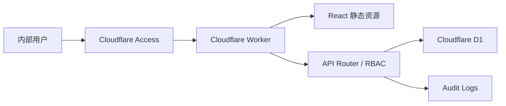

# 生产部署与上线验收方案

## 1. 目标

本方案用于把内部管理会计台账从本地验证状态推进到 Cloudflare 生产可用状态，并明确上线前检查、上线步骤、验收标准、回滚方式和上线后观察窗口。

上线目标不是“能打开页面”即可，而是确认以下生产边界成立：

- Cloudflare Access 是唯一生产入口身份层。
- Worker 后端验证 Access JWT 后再映射内部人员。
- 生产环境不启用 development auth。
- D1 迁移、备份、管理员登录映射可追溯。
- 单据录入、提交、审核、锁账、基础资料权限和报表读取在真实部署环境中可用。
- 出现权限、数据、部署异常时有明确回滚和暂停方案。

## 2. 上线范围

本次上线范围：

- Cloudflare Worker + 静态前端资源部署。
- Cloudflare D1 生产库迁移。
- Cloudflare Access self-hosted application 保护生产域名。
- 内部人员 `people.login_email` 与 Access 登录邮箱映射。
- 身份权限、审核中心、锁账月结、基础资料治理、报表中心的生产 smoke test。
- 审计日志写入 `actor_person_id`、`actor_email` 和请求元数据。

本次不上线范围：

- 历史表格正式导入和清洗。
- 附件、凭证上传、导出包。
- 自动备份调度。
- 多环境 CI/CD 自动发布。
- 大规模真实数据初始化。

## 3. 生产架构



生产请求链路：

1. 用户访问生产域名。
2. Cloudflare Access 完成入口认证。
3. Access 向 Worker 请求加入 `Cf-Access-Jwt-Assertion`。
4. Worker 验证 JWT 的签名、issuer、audience 和过期时间。
5. Worker 用 email 查找启用的 `people.login_email`。
6. API 根据内部角色 capability 决定是否允许业务操作。
7. 写操作记录业务数据和审计日志。

## 4. 上线前置条件

### 4.1 代码条件

上线前必须满足：

- `main` 是待上线代码。
- 工作树干净。
- 依赖已安装并与 `package-lock.json` 一致。
- 本地验证通过：

```sh
npm install
npm test
npx tsc --noEmit
npm run build
```

当前上线基线应记录：

```sh
git rev-parse HEAD
git status --short
```

### 4.2 Cloudflare 条件

上线前必须准备：

- Cloudflare 账号可用，`npx wrangler whoami` 能确认登录身份。
- Worker 名称为 `management-ledger`。
- D1 database name 为 `management-ledger-db`。
- `wrangler.jsonc` 中 `database_id` 指向目标生产 D1。
- Cloudflare Access self-hosted application 已创建并覆盖生产 Worker hostname。
- 已取得 Access application audience tag。
- 已确认生产 Access team domain，例如：

```text
https://<team-name>.cloudflareaccess.com
```

### 4.3 生产环境变量

生产 Worker 必须设置：

```sh
AUTH_MODE=access
CF_ACCESS_TEAM_DOMAIN=https://<team-name>.cloudflareaccess.com
CF_ACCESS_AUD=<Application Audience AUD tag>
```

生产 Worker 不得设置：

```sh
AUTH_MODE=development
ALLOW_INSECURE_DEV_AUTH=true
DEV_ACTOR_EMAIL=<any email>
```

如果生产环境误设 `AUTH_MODE=development` 但没有 `ALLOW_INSECURE_DEV_AUTH=true`，系统会拒绝开发身份登录；这属于安全保护，不应通过打开 unsafe 开关解决。

## 5. 数据准备与备份

### 5.1 上线前备份

上线前导出远程 D1：

```sh
mkdir -p backups
npx wrangler d1 export management-ledger-db --remote --output backups/prelaunch-YYYYMMDD-HHMM.sql
```

验收要求：

- 导出命令成功。
- 备份文件存在且大小非 0。
- 备份文件不要提交到 Git。
- 记录备份文件名、执行人、执行时间。

### 5.2 迁移

执行远程迁移：

```sh
npm run db:migrate:remote
```

验收要求：

- 所有 migration 执行成功。
- `0007_identity_permissions_review.sql` 已应用。
- `people` 表具备 `login_email`、`access_subject`、`last_login_at`。
- `audit_logs` 表具备 `actor_person_id`、`actor_email`、`request_id`、`ip_address`、`user_agent`。

### 5.3 首个管理员映射

Access 配置完成后，用占位符替换本地值执行首个管理员登录邮箱映射：

```sh
npx wrangler d1 execute management-ledger-db --remote --command "UPDATE people SET login_email = '<admin@example.com>' WHERE id = '<admin_person_id>'"
```

验收要求：

- `<admin@example.com>` 必须是实际 Access 登录邮箱。
- `<admin_person_id>` 必须是已启用且具备 `admin` 角色的人员 ID。
- 不提交真实邮箱或人员 ID 到仓库。
- 映射后通过 `/api/me` 能返回该人员和 capabilities。

## 6. 部署步骤

### 6.1 部署前确认

```sh
npx wrangler whoami
npx wrangler d1 info management-ledger-db
npm test
npx tsc --noEmit
npm run build
```

### 6.2 部署

```sh
npm run deploy
```

部署后记录：

```sh
npx wrangler deployments status
npx wrangler deployments list
```

记录内容：

- 部署时间。
- Git commit。
- Worker deployment/version id。
- 执行人。
- D1 备份文件名。
- Access application AUD tag 是否已配置到 Worker。

## 7. 上线验收

### 7.1 访问与身份验收

验收步骤：

1. 使用未登录浏览器访问生产域名。
2. 确认被 Cloudflare Access 拦截或跳转到 Access 登录。
3. 使用已授权管理员邮箱登录。
4. 打开系统首页。
5. 确认顶部显示当前登录人员、邮箱和角色。
6. 打开浏览器 Network 或使用 API 请求验证 `/api/me` 返回 200。

通过标准：

- 未通过 Access 的用户无法进入系统。
- `/api/me` 返回当前登录邮箱映射的内部人员。
- 没有出现“当前操作人”手动选择器。
- 生产页面不显示 development auth 提示或本地测试邮箱。

### 7.2 权限菜单验收

准备至少 4 类账号：

- `admin`
- `finance_manager`
- `finance_entry`
- `readonly`

验收标准：

| 角色 | 应可见 | 不应可见或不可操作 |
| --- | --- | --- |
| admin | 全部功能 | 无 |
| finance_manager | 业务单据、审核中心、报表中心、基础资料、锁账月结 | 解锁功能按能力限制 |
| finance_entry | 业务单据、报表中心、可查看基础资料 | 审核中心、锁账、角色维护 |
| readonly | 业务单据、基础资料、报表中心只读 | 创建、提交、审核、基础资料写入 |

通过标准：

- 前端不展示无权限的主要写按钮。
- 直接调用无权限 API 返回 403。
- `borrower` 角色不获得业务写权限。

### 7.3 单据流程验收

使用财务录入或主管账号：

1. 创建一张项目收入草稿。
2. 提交草稿。
3. 确认状态变为待审核。
4. 切换到审核中心。
5. 打开待审核单据详情。
6. 确认审批预览显示账户影响。
7. 通过审核。
8. 回到单据列表确认状态为已审核。
9. 打开报表中心确认相关收入或账户余额变化。

通过标准：

- 创建 payload 不包含伪造 `createdBy`。
- 提交/审核使用登录 session actor。
- 审计日志记录 `actor_person_id` 和 `actor_email`。
- 审批预览和实际审核使用同一套 planning 逻辑。

### 7.4 锁账验收

使用有锁账权限账号：

1. 锁定当前测试期间，例如 `2026-04`。
2. 创建同期间新草稿并提交，或使用已有同期间待审单据。
3. 打开审核中心。
4. 确认审批预览显示期间已锁定错误。
5. 确认通过按钮不可用或审核 API 返回错误。
6. 如需继续测试，使用有解锁权限账号填写原因并解锁。

通过标准：

- 锁账后同期间不能审核过账。
- 解锁必须填写原因。
- 锁账和解锁均写入审计日志。

### 7.5 基础资料验收

使用不同角色验证：

- readonly：只能查看，不能新增、编辑、停用。
- finance_manager：可维护普通基础资料；不能改变人员角色。
- admin：可维护人员角色。

通过标准：

- 无 `masterData.write` 时前端不展示写表单或写按钮。
- 无 `masterData.managePeopleRoles` 时不能变更人员角色。
- 后端对越权角色变更返回 403。
- 基础资料审计包含 actor metadata。

### 7.6 报表验收

检查以下报表接口和页面：

- 账户余额。
- 商户收入。
- 项目收入。
- 项目损益。
- 费用明细和汇总。
- 借款余额和账龄。
- FIFO 批次余额和流转。
- 异常检查。

通过标准：

- 报表只读。
- 已审核单据进入报表。
- 草稿、待审、退回单据不进入正式报表。
- readonly 可看报表但不可写业务数据。

## 8. 上线观察窗口

建议上线后观察 2 小时，重点检查：

- Cloudflare Worker 请求错误率。
- `/api/me` 401/403 是否异常集中。
- D1 查询是否明显变慢。
- 审核、锁账、基础资料写入是否有 400/403/500 异常。
- 用户是否反馈菜单缺失或权限不符合。
- 审计日志是否持续写入 actor metadata。

观察期间不建议同时上线数据导入、附件、导出等新功能。

## 9. 回滚方案

### 9.1 代码回滚

先查看部署记录：

```sh
npx wrangler deployments list
```

回滚到上一版本：

```sh
npx wrangler rollback <version-id> --message "Rollback after production acceptance issue"
```

回滚后验证：

```sh
npx wrangler deployments status
```

### 9.2 数据回滚

数据回滚必须比代码回滚更谨慎。优先策略：

1. 若只是前端或权限配置问题，先回滚 Worker，不回滚 D1。
2. 若 migration 后数据结构异常但未发生真实业务写入，评估使用 D1 Time Travel。
3. 若已有真实业务写入，禁止直接覆盖数据库；先导出当前库，再由负责人决定修复脚本或点时间恢复。

查看 D1 Time Travel：

```sh
npx wrangler d1 time-travel info management-ledger-db
```

恢复前必须确认：

- 恢复时间点。
- 会丢失哪些写入。
- 是否已有审核、锁账、基础资料写入。
- 是否已通知所有使用者停止操作。

### 9.3 暂停方案

如需立即暂停生产访问：

- 在 Cloudflare Access 中收紧允许策略，只保留管理员。
- 或临时移除普通用户组。
- 不通过打开 development auth 解决任何生产问题。

## 10. Go / No-Go 标准

### Go

满足全部条件才可正式开放：

- `npm test`、`npx tsc --noEmit`、`npm run build` 通过。
- D1 备份完成。
- 远程 migration 成功。
- Cloudflare Access 已保护生产域名。
- 生产 Worker env 无 development auth。
- 首个 admin login_email 映射成功。
- 身份、权限、单据、审核、锁账、基础资料、报表 smoke test 通过。
- 回滚版本和备份文件已记录。

### No-Go

任一情况出现，应停止上线：

- Access 未保护生产域名。
- `CF_ACCESS_AUD` 或 team domain 不确定。
- 生产 env 出现 `ALLOW_INSECURE_DEV_AUTH=true`。
- 远程 D1 未备份。
- migration 失败。
- 首个 admin 无法登录。
- 审核可绕过锁账。
- 只读用户能完成写操作。
- 审计日志缺失登录 actor。

## 11. 上线记录模板

```md
## 上线记录

- 系统：内部管理会计台账
- 日期：
- 执行人：
- 验收人：
- Git commit：
- Worker deployment/version id：
- D1 database：
- D1 备份文件：
- Access application：
- 首个 admin person id：
- 首个 admin login email：仅记录到安全运维渠道，不写入 Git

### 验证结果

- npm test：
- npx tsc --noEmit：
- npm run build：
- D1 migration：
- /api/me：
- 单据创建/提交：
- 审核中心预览/通过：
- 锁账阻断：
- 基础资料权限：
- 报表读取：

### 问题记录

- 问题：
- 处理：
- 是否影响上线：

### 结论

- Go / No-Go：
- 观察窗口开始：
- 观察窗口结束：
```

## 12. 后续改进

上线完成后再进入以下工作：

1. 正式数据导入/清洗中心。
2. 自动备份和恢复演练。
3. 附件与凭证管理。
4. 报表导出和月结包。
5. CI/CD 发布审批流程。
