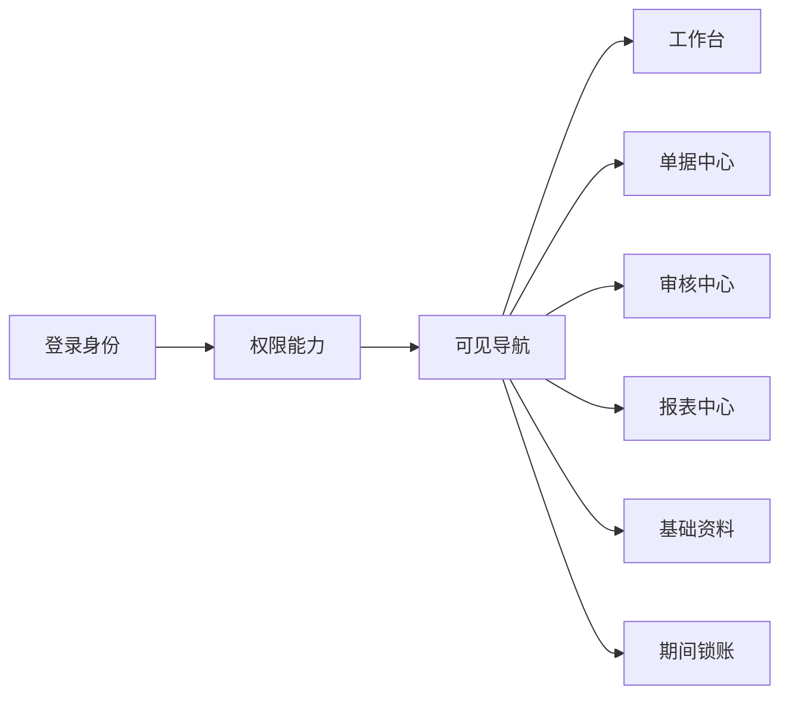
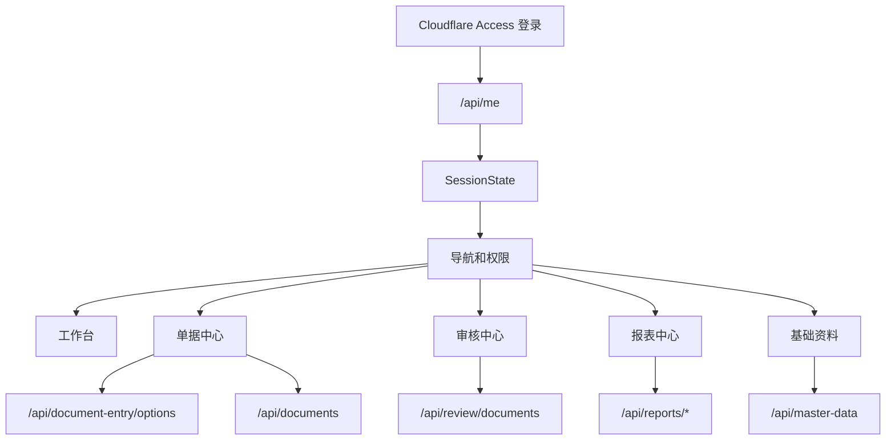

# 正式版前端重设计方案

日期：2026-04-26

状态：设计草案，等待确认后进入实施计划。

## 1. 背景

当前前端已经能跑通内部管理会计系统的核心链路：登录身份、单据录入、审核、报表、基础资料、锁账。但页面形态仍偏 MVP，主要服务于验证业务规则和接口，而不是正式运营使用。

主要问题：

- 全局导航像功能标签页，不像正式系统工作台。
- 页面之间缺少统一任务视角，用户进入系统后不知道“下一件该处理什么”。
- 单据中心把录入、列表和流程动作挤在同一页，信息层级不清。
- 审核中心、报表中心、基础资料中心虽然功能逐步完整，但视觉和交互仍像表格堆叠。
- 表单控件、筛选条、表格、状态标签、操作区缺少统一组件语言。
- 页面宽度、密度、留白和金额展示还没有达到财务系统的正式感。

前端下一阶段不应只做换色和圆角，而应把系统重构为正式的“财务运营工作台”。

## 2. 目标

本阶段目标是把现有前端升级为正式版操作界面，同时保持现有 React、Worker API、D1 数据模型和业务规则不变。

范围内：

- 重做全局应用外壳和主导航。
- 增加正式工作台首页。
- 重构单据中心为列表、录入、详情更清晰的工作流。
- 重构审核中心为待处理队列和审核详情工作流。
- 重构报表中心的信息架构和筛选体验。
- 重构基础资料治理中心为列表加详情编辑的治理界面。
- 建立统一的前端视觉系统和可复用界面组件。
- 保持权限能力对导航、按钮、字段和操作的控制。

范围外：

- 不改变后端会计过账、FIFO、借款、备用金、报表计算口径。
- 不做 Excel 导入。
- 不做附件上传。
- 不做多级审批。
- 不做移动端独立 App。
- 不引入大型 UI 框架作为重写前提。
- 不做营销页、宣传页或 hero 式首页。

## 3. 设计原则

- 前端以工作流组织，不以数据库对象组织。
- 用户看到业务名称和状态，不看到数据库 ID。
- 所有高风险操作必须有清楚的状态、权限和反馈。
- 财务金额、期间、币种、人员、项目、商户必须易扫读。
- 表格可以密，但不能乱；留白服务于层级，不做装饰。
- 卡片只用于独立模块、指标和详情区域，不把页面切成一堆漂浮卡片。
- 控件样式统一，交互反馈明确，避免每个页面各写一套。
- 正式系统优先可用性、稳定性和审计清晰度，视觉表达克制。

## 4. 方案选择

### 方案 A：只改 CSS

保留现有页面结构，只统一颜色、按钮、表格和间距。

优点是最快。缺点是业务流程仍然散，单据和审核还是测试页气质。它只能让界面“好看一点”，不能变成正式系统。

### 方案 B：引入组件库后大重写

引入完整 UI 组件库，把页面全部重写为组件库风格。

优点是组件多、速度看似快。缺点是当前系统业务表单和规则已经较深，引入大型组件库会带来样式、打包、可访问性和定制成本，也容易把精力从业务工作流转移到组件适配。

### 方案 C：保留技术栈，重构产品结构和设计系统

继续使用当前 React + CSS + Worker API 架构，先建立正式版应用外壳、工作台、页面布局和共享组件，再逐页替换现有页面。

采用方案 C。

理由：

- 不破坏已经稳定的业务规则和测试体系。
- 能逐步交付，不需要一次性停下来重写全站。
- 可直接围绕内部管理会计的真实工作流设计，而不是被组件库模板牵着走。
- 后续仍可在局部引入轻量组件或图表库，但不是前置条件。

## 5. 信息架构

正式版前端采用五个一级模块：

| 模块 | 目的 | 主要用户 |
| --- | --- | --- |
| 工作台 | 展示待处理任务、经营快照和异常提醒 | 所有人 |
| 单据中心 | 创建、编辑、提交、查看业务单据 | 财务录入、后勤、财务主管 |
| 审核中心 | 审核待处理单据并查看影响预览 | 财务主管、管理员 |
| 报表中心 | 查看经营、资金、费用、备用金、借款和异常报表 | 管理层、财务 |
| 基础资料 | 治理人员、项目、商户、账户、币种、科目 | 管理员、财务主管 |
| 期间锁账 | 锁定或解锁会计期间 | 管理员 |

主导航根据权限显示。无权限模块不展示，模块内无权限操作禁用或隐藏。

## 6. 全局应用外壳

正式版使用稳定的后台系统布局。

结构：

- 左侧主导航，固定宽度，展示系统名称、主模块和当前模块状态。
- 顶部状态栏，展示当前人员、角色、当前期间、权限状态和常用操作。
- 主内容区，采用页面标题、筛选/操作条、主要工作区三段结构。
- 页面内二级导航使用 tabs 或侧栏，不再把所有一级模块放在顶部小按钮里。

桌面端：

- 左侧导航宽度约 224px。
- 主内容区最大宽度不强制限制到 1180px，报表和表格页面应能使用宽屏。
- 页面保持 16px 到 24px 的统一间距节奏。

窄屏：

- 左侧导航折叠为顶部模块入口。
- 表格保留横向滚动，不强行改成卡片。
- 录入表单改为单列，底部操作栏固定在可见区域内。

## 7. 工作台首页

工作台不是营销首页，而是进入系统后的任务入口。

模块：

### 7.1 待处理

展示与当前登录人相关的任务：

- 我的草稿。
- 被退回单据。
- 待我审核。
- 长时间待处理单据。

每个任务项展示单据编号、类型、业务日期、摘要、金额或主要对象、状态和下一步动作。

### 7.2 经营快照

展示管理层常看的少量指标：

- USDT 基础口径总览。
- 公司账户余额。
- 储备金余额。
- 人员备用金余额。
- 借款余额。
- 本月收入、费用、利润口径。

指标来自现有报表接口，不在前端自行计算会计结果。

### 7.3 异常提醒

聚合现有异常检查：

- 负备用金。
- 未匹配成本。
- 长时间待审。
- 未绑定登录邮箱的关键人员。
- 基础资料缺失或停用导致录入不可用。

异常提醒应能跳转到对应页面和筛选条件。

### 7.4 快捷操作

根据权限展示：

- 新增项目收入。
- 新增换汇。
- 新增备用金发放。
- 新增备用金报销。
- 新增借款。
- 进入审核队列。
- 进入报表中心。

快捷操作只打开真实工作流，不做假按钮。

## 8. 单据中心重设计

单据中心拆成三块：

- 左侧或上方筛选列表。
- 中间单据列表。
- 右侧详情或录入抽屉。

### 8.1 单据列表

列表字段：

- 单据编号。
- 类型。
- 状态。
- 业务日期。
- 期间。
- 经办人。
- 项目/商户。
- 摘要。
- 最近更新时间或提交时间。

筛选：

- 状态。
- 单据类型。
- 期间。
- 项目。
- 商户。
- 人员。
- 日期范围。

列表支持点击单据打开详情，不需要进入单独页面。

### 8.2 单据录入

录入采用分区式表单，不再是一张平铺长表单。

分区：

1. 基本信息：单据类型、业务日期、期间、经办人、摘要。
2. 业务对象：项目、商户、人员、借款人等。
3. 资金信息：账户、币种、金额、USDT 折算、汇率。
4. 规则提示：当前单据类型下必须满足的规则。
5. 操作区：保存草稿、提交审核、取消。

不同单据类型只显示相关字段。项目、商户、人员、账户、科目、原单据必须从选项中选择。

### 8.3 单据详情

详情展示：

- 单据状态流转。
- 基础信息。
- 分录明细。
- 账户影响。
- 备用金、借款、FIFO 批次影响。
- 审计记录。

对草稿和退回单据，具备权限者可编辑和提交。对待审核单据，具备审核权限者可跳转审核中心或直接进入审核详情。

## 9. 审核中心重设计

审核中心以“队列 + 详情 + 影响预览”为核心。

### 9.1 审核队列

默认展示待审核单据，支持按类型、期间、项目、提交人筛选。

队列项展示：

- 单据编号。
- 类型。
- 提交人。
- 提交时间。
- 业务日期。
- 摘要。
- 关键金额。
- 风险标签。

### 9.2 审核详情

详情区域展示：

- 原始单据内容。
- 业务规则校验结果。
- 账户过账预览。
- FIFO 批次消耗或恢复预览。
- 备用金待匹配影响。
- 借款余额影响。
- 历史关联单据。

### 9.3 审核操作

操作固定在详情区底部或右侧：

- 审核通过。
- 退回修改。
- 查看原单据。

退回必须填写原因。审核通过前必须展示影响预览，不能只给一个按钮。

## 10. 报表中心重设计

报表中心按管理会计口径分组：

| 分组 | 报表 |
| --- | --- |
| 资金 | 账户余额、批次余额、批次流水 |
| 项目经营 | 项目收入、商户收入、项目损益 |
| 费用 | 费用明细、费用汇总 |
| 备用金 | 待匹配成本、备用金待补足 |
| 借款 | 借款余额、账龄、还款分摊、核销 |
| 异常 | 异常检查 |

统一筛选条：

- 期间。
- 开始日期、结束日期。
- 项目。
- 商户。
- 人员。
- 币种。

展示规则：

- 金额列右对齐。
- 负数、异常、待处理使用统一风险颜色。
- 表格标题展示当前筛选条件。
- 空状态说明是“无数据”还是“筛选后无结果”。
- 报表之间保留跳转关系，例如异常项可跳转到对应报表。

## 11. 基础资料治理中心重设计

基础资料采用治理型布局：

- 左侧分类：人员、项目、商户、账户、币种、管理科目。
- 中间列表：搜索、筛选、状态、引用数。
- 右侧详情/编辑抽屉：查看、创建、编辑、启停。

### 11.1 人员

人员详情拆成两区：

- 业务人员资料：姓名、别名、业务角色、启用状态。
- 登录身份与权限：登录邮箱、角色、最近登录、可登录状态。

没有 `masterData.managePeopleRoles` 权限时，身份字段只读，并在保存时保留原值。

### 11.2 项目和商户

项目详情展示：

- 基本资料。
- 关联商户。
- 负责人。
- 引用状态。

商户详情展示：

- 所属项目。
- 商户类型。
- 负责人。
- 状态。

### 11.3 账户

账户详情必须清楚区分：

- 公司账户。
- 储备金账户。
- 人员备用金账户。
- 临时账户。

备用金账户必须展示所属人员和是否允许负数。

### 11.4 科目

科目详情展示：

- 科目类型。
- 流向。
- 是否影响费用报表。
- 是否影响项目报表。
- 是否要求商户、人员、借款人。

这些字段决定单据录入规则，编辑时必须比普通文本字段更谨慎。

## 12. 视觉系统

正式版视觉应偏金融后台和运营工作台。

### 12.1 色彩

基础色：

- 页面背景：浅灰白。
- 主文字：近黑墨色。
- 次级文字：灰蓝。
- 边框：浅灰。

功能色：

- 主操作：深青。
- 成功：绿色。
- 警告：琥珀色。
- 风险：红色。
- 信息：蓝灰。

避免：

- 大面积渐变。
- 装饰性光斑。
- 单一色系铺满全站。
- 过度深色导致长时间录入疲劳。

### 12.2 字体和密度

- 使用系统无衬线字体。
- 页面标题 20px 到 24px。
- 区块标题 15px 到 16px。
- 表格和表单正文 13px 到 14px。
- 金额和编号可使用等宽字体。
- 不使用视口宽度驱动字体大小。

### 12.3 组件形态

统一组件：

- AppShell。
- SidebarNavigation。
- TopStatusBar。
- PageHeader。
- FilterBar。
- DataTable。
- DetailDrawer。
- FormSection。
- StatusTag。
- AmountCell。
- EmptyState。
- Notice。
- ActionBar。

组件半径控制在 6px 到 8px。按钮、输入框、表格、标签应有稳定尺寸，避免内容变化导致布局跳动。

## 13. 交互和状态

必须统一处理：

- 加载中。
- 空状态。
- 读取失败。
- 保存中。
- 保存成功。
- 权限不足。
- 字段校验失败。
- 后端业务规则失败。

原则：

- 页面级错误放在页面顶部或主要工作区。
- 字段错误贴近字段。
- 保存成功使用轻量提示，不打断工作。
- 高风险操作需要明确确认或可回退路径。
- 禁用操作要说明原因，不能只是按钮灰掉。

## 14. 数据流

正式版前端仍使用现有 API，新增工作台接口可后续补充。

前端不能直接计算正式会计结果。所有余额、FIFO、借款、备用金、损益结果必须来自后端接口。

## 15. 权限表现

权限不仅控制 API，也控制界面。

| 能力 | 前端表现 |
| --- | --- |
| `documents.create` | 显示新增单据入口。 |
| `documents.submit` | 草稿和退回单据显示提交入口。 |
| `documents.approve` | 显示审核队列和审核通过入口。 |
| `documents.reject` | 显示退回入口。 |
| `reports.view` | 显示报表中心。 |
| `masterData.view` | 显示基础资料。 |
| `masterData.write` | 显示基础资料编辑入口。 |
| `masterData.managePeopleRoles` | 允许编辑人员身份和角色字段。 |
| `periodLocks.lock` | 显示锁账入口。 |
| `periodLocks.unlock` | 显示解锁入口。 |

前端隐藏或禁用操作只是体验优化，最终权限仍由后端强制执行。

## 16. 实施分期

### 阶段 1：设计系统和应用外壳

- 建立 AppShell、Sidebar、TopStatusBar、PageHeader。
- 替换现有顶部 tabs。
- 统一按钮、表格、标签、表单、提示样式。
- 保持现有页面功能不变。

### 阶段 2：工作台首页

- 增加工作台模块。
- 先使用现有接口组合展示任务、快照和异常。
- 缺少专用接口时显示可解释的空状态或降级数据。

### 阶段 3：单据中心重构

- 重构单据列表和筛选。
- 将单据录入改为分区表单或抽屉。
- 增强详情和状态流转展示。

### 阶段 4：审核中心重构

- 建立审核队列和详情布局。
- 强化影响预览。
- 固定审核操作区。

### 阶段 5：报表中心重构

- 按正式分组展示报表。
- 统一筛选条。
- 优化金额、状态、异常展示。

### 阶段 6：基础资料治理中心重构

- 建立分类侧栏、列表、详情抽屉。
- 强化人员身份分区。
- 优化账户、科目、项目、商户的治理体验。

## 17. 测试和验收

自动化测试：

- 导航权限测试。
- 工作台渲染测试。
- 表单字段显示规则测试。
- 无权限按钮隐藏或禁用测试。
- 报表筛选模型测试。
- 基础资料身份字段保留测试。

浏览器验收：

- 桌面端 1440px 宽度下主流程不拥挤。
- 窄屏下导航、表单和表格可用。
- 单据新增、提交、审核、退回路径可点击跑通。
- 报表筛选和表格横向滚动正常。
- 基础资料编辑权限表现正确。
- 所有页面无明显文本重叠、按钮溢出、表格错位。

上线验收：

- 管理员可以登录并看到所有模块。
- 财务录入只能看到和执行录入相关操作。
- 财务主管可以审核和查看报表。
- 只读角色无法执行写操作。
- 未绑定登录邮箱的人员不能作为当前登录人。

## 18. 风险和约束

| 风险 | 处理 |
| --- | --- |
| 前端重构范围过大 | 分阶段实施，每阶段保持可构建和可部署。 |
| 页面变漂亮但工作流未改善 | 每个阶段都绑定具体业务流程验收。 |
| 新外壳影响现有权限 | 先用现有 `visibleNavigationItems` 和 capability 模型。 |
| 宽表格在小屏不可用 | 保留横向滚动，关键操作固定在可见区域。 |
| 工作台缺少专用聚合接口 | 初期组合现有接口，后续再补工作台专用 API。 |
| 视觉系统失控 | 先定义共享组件和 token，再改页面。 |

## 19. 成功标准

正式版前端完成后，应达到以下状态：

- 用户登录后能从工作台直接知道待处理任务。
- 单据录入按业务类型呈现，不再像工程测试表单。
- 审核人员能在一个页面看懂单据内容和过账影响。
- 报表中心按管理会计口径分组，筛选和金额阅读清晰。
- 基础资料维护能清楚区分业务资料和登录身份。
- 权限在导航、按钮和字段层面都有明确表现。
- 全站视觉统一、克制、稳定，适合内部长期使用。

