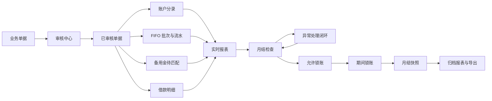
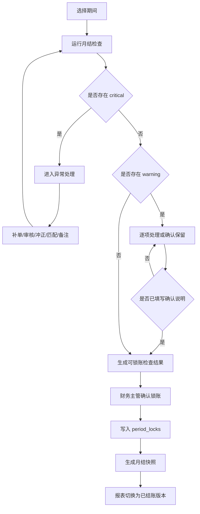

# 对账与月结中心设计方案

日期：2026-04-26

状态：设计草案，等待确认后进入实施计划。

## 1. 背景

当前系统已经具备正式财务台账的核心骨架：

- 单据录入、提交、审核、驳回和冲正。
- 基础资料治理，项目、商户、人员、账户、币种、科目逐步受控。
- USDT 基础币种、多币种账户、换汇批次和 FIFO 成本消耗。
- 备用金、报销、借款、核销等管理会计业务。
- 报表中心已经能按资金、项目经营、费用、备用金、借款、异常分组查看，并支持筛选、摘要、钻取和导出。
- 系统已有期间锁账能力，锁账后审批过账会被期间锁阻断。

但目前的“锁账”仍是偏技术层的开关：系统可以锁住一个期间，却还不能明确回答“这个期间是否已经对账完成，是否可以结账，结账后的报表是否可追溯”。

正式内部管理会计系统下一步要补齐的是月结闭环：

- 结账前自动检查数据完整性。
- 财务人员能按账户、备用金、借款、项目、商户、费用、FIFO 批次做对账。
- 异常必须有处理状态、责任人、备注和审计。
- 锁账时固化关键报表快照，形成可归档版本。
- 锁账后如需调整，必须通过后续期间更正或受控解锁处理。

## 2. 目标

本阶段目标是建设“对账与月结中心”，把现有报表和期间锁账升级为正式结账流程。

范围内：

- 新增月结工作台，按期间展示结账状态。
- 新增月结检查清单，自动汇总未审核、待匹配、异常余额、借款超期、FIFO 成本异常等问题。
- 新增对账汇总视图，覆盖资金、备用金、借款、项目经营、费用和换汇批次。
- 新增异常处理闭环，支持处理状态、责任人、备注、处理时间和审计。
- 新增月结快照，锁账时固化关键报表和检查结果。
- 改造期间锁账流程，要求先完成检查和确认，再允许锁账。
- 报表中心支持查看实时数据和已结账快照。

范围外：

- 不改变现有单据审核、过账、FIFO、借款核销核心规则。
- 不做银行流水自动导入。
- 不做 Excel 导入。
- 不做外部支付通道对接。
- 不做多公司、多账套。
- 不做法定财务报表，只覆盖内部管理会计。
- 不把月结快照作为新的记账来源，记账来源仍然是已审核单据及其过账副作用。

## 3. 现状判断

已有能力：

| 能力 | 当前状态 |
| --- | --- |
| 期间字段 | 单据已有 `period`，格式为 `YYYY-MM`。 |
| 期间锁账 | 已有 `period_locks`，锁账后审批过账会被阻断。 |
| 审计日志 | 已有 `audit_logs`，关键写操作可记录 actor、原因和前后快照。 |
| 报表接口 | 已有资金、经营、费用、备用金、借款、异常检查接口。 |
| 异常检查 | 已覆盖待匹配成本、负账户、长时间待审/草稿、超期借款。 |
| 报表筛选 | 已支持期间、项目、商户、人员、币种、异常天数。 |

主要缺口：

- 锁账前没有强制检查。
- 检查结果没有留痕，后续无法证明当时为什么允许结账。
- 异常只能看，不能分配、处理、备注、关闭。
- 报表导出是实时导出，不是结账版本。
- 解锁只记录原因，还没有和重新检查、快照版本关联。
- 月结状态没有统一页面，财务人员需要在报表、审核、期间锁账之间来回切。

## 4. 设计原则

- 源数据唯一：所有会计结果仍来自已审核单据、账户分录、FIFO 批次、待匹配成本、借款明细。
- 快照只归档，不反向参与过账。
- 锁账前必须先检查，检查结果必须可追溯。
- `critical` 异常默认阻断结账。
- `warning` 异常允许带确认说明结账，但必须留痕。
- 备用金可以为负，负备用金不是天然阻断项；长期未报销、超阈值或无说明才升级为阻断。
- 多币种对账以原币余额和 USDT 成本口径同时展示，不强行混成单一金额。
- 更正不直接改历史事实；锁账后错误通过后续期间更正单、冲正单或受控解锁处理。
- 月结中心服务财务运营，不替代审核中心和报表中心。

## 5. 核心概念

### 5.1 对账期间

对账期间使用 `YYYY-MM`，与单据 `period` 一致。

期间状态：

| 状态 | 说明 |
| --- | --- |
| `open` | 未开始月结，期间仍可提交和审核。 |
| `checking` | 正在执行检查或已有检查结果。 |
| `ready_to_lock` | 无阻断项，或阻断项已处理，允许锁账。 |
| `locked` | 已锁账，历史单据不能在该期间继续审批过账。 |
| `reopened` | 曾锁账后被解锁，需要重新检查和重新锁账。 |

### 5.2 月结运行

每次点击“运行检查”生成一条月结运行记录。运行记录保存：

- 期间。
- 运行人。
- 运行时间。
- 检查版本。
- 检查结果摘要。
- 是否允许锁账。

同一期间可以多次运行检查。最终锁账必须引用最近一次通过或确认通过的检查结果。

### 5.3 月结快照

月结快照是在锁账时生成的归档数据，包含：

- 检查结果快照。
- 对账汇总快照。
- 报表数据快照。
- 锁账人、锁账时间、备注。
- 版本号。

快照用于查看、导出、审计，不作为后续报表计算的源数据。

### 5.4 异常处理

异常处理是针对检查项或异常项的闭环记录。

状态：

| 状态 | 说明 |
| --- | --- |
| `open` | 系统发现，尚未处理。 |
| `assigned` | 已指定责任人。 |
| `acknowledged` | 已确认原因，但未消除。 |
| `resolved` | 已通过补单、审核、冲正、匹配等方式消除。 |
| `waived` | 管理上允许保留，必须填写原因。 |

`waived` 只适用于 warning 或 info；critical 原则上必须 resolved，除非管理员解锁规则并留审计。

## 6. 总体数据流



关键点：

- 月结检查读取实时数据。
- 异常处理本身不改变会计数据，只记录处理流程。
- 真正消除异常仍依赖补单、审核、冲正、匹配、归档等业务动作。
- 月结快照在锁账时生成，是当期数据状态的归档版本。

## 7. 业务流程



## 8. 月结检查清单

### 8.1 单据流程检查

检查项：

| 检查 | 口径 | 严重级别 |
| --- | --- | --- |
| 未提交草稿 | `documents.status = 'draft'` 且期间为目标期间 | info |
| 长时间草稿 | 草稿超过阈值 | info |
| 待审核单据 | `documents.status = 'pending'` 且期间为目标期间 | critical |
| 长时间待审核 | 待审核超过阈值 | warning |
| 被退回未修正 | `documents.status = 'rejected'` 且期间为目标期间 | warning |

月结要求：

- 目标期间不能存在待审核单据。
- 草稿不阻断结账，但需要提示，避免遗漏真实业务。
- 退回单据需要财务确认是否放弃或下期重录。

### 8.2 资金账户检查

检查项：

| 检查 | 口径 | 严重级别 |
| --- | --- | --- |
| 公司账户负数 | 公司账户且不允许负数，余额小于 0 | critical |
| 账户币种不一致 | 账户币种与分录币种不一致 | critical |
| 停用账户仍有新增流水 | 归档账户在期间内出现新分录 | warning |
| USDT 主账户异常 | USDT 主账户余额小于管理阈值 | warning |

展示维度：

- 账户。
- 币种。
- 期初余额。
- 本期增加。
- 本期减少。
- 期末余额。
- 涉及单据数。

### 8.3 换汇批次与 FIFO 检查

检查项：

| 检查 | 口径 | 严重级别 |
| --- | --- | --- |
| 批次余额负数 | `lots.remaining_amount_minor < 0` 或 `remaining_usdt_cost_minor < 0` | critical |
| 批次金额不守恒 | 原始金额与流水消耗、剩余金额不匹配 | critical |
| FIFO 顺序异常 | 较晚批次先被消耗且较早可用批次仍未消耗 | warning |
| 批次长期未消耗 | 超过阈值仍有余额 | info |

说明：

- FIFO 是成本口径核心，不允许锁账时存在批次负数或成本不守恒。
- FIFO 顺序异常先作为 warning，因为可能存在账户、人员、币种隔离导致的合理差异。

### 8.4 备用金检查

检查项：

| 检查 | 口径 | 严重级别 |
| --- | --- | --- |
| 待匹配成本 | `pending_cost_matches.remaining_amount_minor > 0` | warning |
| 待匹配超期 | 待匹配成本超过阈值 | critical |
| 备用金负数 | 备用金账户余额小于 0 | warning |
| 备用金负数超期 | 负数持续超过阈值或超过金额阈值 | critical |
| 人员停用仍有余额 | 停用人员名下仍有备用金余额 | warning |

业务口径：

- 备用金允许为负数，因为后勤人员可以先垫付，再申请备用金并整体报销。
- 真正风险不是“负数”本身，而是长期不清、金额过大或没有后续补足计划。
- 报销成本按实际消费日期归属期间。

### 8.5 借款检查

检查项：

| 检查 | 口径 | 严重级别 |
| --- | --- | --- |
| 借款超期 | 借款项未结清且超过阈值 | warning |
| 借款余额负数 | 借款人币种余额小于 0 | critical |
| 借款核销缺少项目/科目 | 核销单影响费用但缺少必要归属 | critical |
| 停用人员仍有借款 | 停用人员名下仍有借款余额 | warning |

### 8.6 项目经营检查

检查项：

| 检查 | 口径 | 严重级别 |
| --- | --- | --- |
| 项目收入无商户 | 项目收入单缺少商户 | critical |
| 商户不属于项目 | 单据项目与商户所属项目不一致 | critical |
| 项目成本未完整匹配 | 项目费用存在 pending cost | warning |
| 项目已归档仍有新单 | 归档项目在期间内出现新单据 | warning |
| 商户已归档仍有新收入 | 归档商户在期间内出现新收入 | warning |

业务口径：

- 项目的收入来自商户。
- 原“部门”概念后续统一为项目。
- 商户是收入来源，项目是经营归属。

## 9. 对账视图设计

对账与月结中心不把所有表格堆在一起，而是按月结任务组织。

一级区域：

1. 期间状态。
2. 月结检查。
3. 资金对账。
4. 备用金对账。
5. 借款对账。
6. 项目经营对账。
7. 快照与导出。

### 9.1 期间状态

展示：

- 当前期间。
- 状态：未检查、检查中、可锁账、已锁账、已解锁。
- 最近检查时间。
- 最近检查人。
- critical / warning / info 数量。
- 最近锁账时间。
- 快照版本。

操作：

- 运行检查。
- 查看检查历史。
- 锁账。
- 解锁。
- 重新检查。
- 查看快照。

### 9.2 月结检查

展示为可操作清单，不只是表格。

字段：

- 检查类型。
- 严重级别。
- 对象类型。
- 对象 ID 或业务名称。
- 金额/币种。
- 业务日期。
- 说明。
- 建议动作。
- 处理状态。
- 责任人。

动作：

- 跳转源单据。
- 跳转报表钻取。
- 指定责任人。
- 添加备注。
- 标记已处理。
- 确认保留。

### 9.3 资金对账

展示账户余额对账表：

| 字段 | 说明 |
| --- | --- |
| 账户 | 账户名称和类型。 |
| 币种 | 原币币种。 |
| 期初余额 | 上期锁账快照或期初累计。 |
| 本期收入 | 本期入账增加。 |
| 本期支出 | 本期出账减少。 |
| 期末余额 | 期初 + 本期净变动。 |
| USDT 成本余额 | 对批次或成本可追溯时展示。 |
| 差异 | 与系统累计余额对比。 |

### 9.4 备用金对账

按人员和账户展示：

- 人员。
- 备用金账户。
- 币种。
- 期初余额。
- 本期领取。
- 本期报销。
- 本期归还。
- 期末余额。
- 待匹配金额。
- 负数持续天数。

### 9.5 借款对账

按借款人和币种展示：

- 借款人。
- 币种。
- 期初借款余额。
- 本期借出。
- 本期还款。
- 本期核销。
- 期末余额。
- 最老未结清借款日期。
- 账龄天数。

### 9.6 项目经营对账

按项目展示：

- 项目。
- 商户数。
- 收入 USDT。
- 费用 USDT。
- 待匹配成本。
- 净额 USDT。
- 成本完整状态。
- 异常数量。

支持从项目钻取到：

- 商户收入。
- 费用明细。
- 待匹配成本。
- 涉及单据。

## 10. 数据模型设计

### 10.1 `month_close_runs`

保存每次检查运行。

| 字段 | 说明 |
| --- | --- |
| `id` | 系统生成。 |
| `period` | 对账期间。 |
| `status` | `running`、`completed`、`failed`。 |
| `can_lock` | 是否允许锁账。 |
| `critical_count` | critical 数量。 |
| `warning_count` | warning 数量。 |
| `info_count` | info 数量。 |
| `started_by` | 运行人。 |
| `started_at` | 开始时间。 |
| `finished_at` | 完成时间。 |
| `error_message` | 失败原因。 |

### 10.2 `month_close_check_results`

保存检查明细。

| 字段 | 说明 |
| --- | --- |
| `id` | 系统生成。 |
| `run_id` | 月结运行 ID。 |
| `period` | 对账期间。 |
| `check_type` | 检查类型。 |
| `severity` | `critical`、`warning`、`info`。 |
| `entity_type` | 对象类型。 |
| `entity_id` | 对象 ID。 |
| `business_date` | 业务日期。 |
| `currency_code` | 币种。 |
| `amount_minor` | 金额。 |
| `usdt_cost_minor` | USDT 成本。 |
| `message` | 说明。 |
| `suggested_action` | 建议动作。 |
| `status` | 处理状态。 |
| `assignee_person_id` | 责任人。 |
| `resolved_by` | 处理人。 |
| `resolved_at` | 处理时间。 |
| `resolution_note` | 处理说明。 |

### 10.3 `month_close_snapshots`

保存锁账快照头。

| 字段 | 说明 |
| --- | --- |
| `id` | 系统生成。 |
| `period` | 对账期间。 |
| `version` | 快照版本，从 1 开始。 |
| `run_id` | 锁账引用的检查运行。 |
| `locked_by` | 锁账人。 |
| `locked_at` | 锁账时间。 |
| `note` | 锁账备注。 |
| `summary_json` | 汇总指标快照。 |

### 10.4 `month_close_report_snapshots`

保存报表快照明细。

| 字段 | 说明 |
| --- | --- |
| `id` | 系统生成。 |
| `snapshot_id` | 快照头 ID。 |
| `report_key` | 报表标识。 |
| `row_count` | 行数。 |
| `data_json` | 报表行 JSON。 |
| `created_at` | 创建时间。 |

说明：

- D1 里先用 JSON 保存快照，减少第一阶段复杂度。
- 快照数据量可控，因为月结只保存目标期间关键报表。
- 后续如果数据量变大，再拆成明细表或对象存储。

### 10.5 `period_locks` 的关系

保留现有 `period_locks` 作为真正的锁账开关。

新增快照表不替代它，而是与它形成关系：

- `period_locks` 表示“这个期间现在是否锁住”。
- `month_close_snapshots` 表示“锁账时归档了什么数据”。
- 解锁时删除 `period_locks`，但不删除历史快照。
- 重新锁账时生成新的快照版本。

## 11. API 设计

新增接口：

| 方法 | 路径 | 说明 | 权限 |
| --- | --- | --- | --- |
| `GET` | `/api/month-close/periods` | 获取期间状态列表 | `periodLocks.view` |
| `GET` | `/api/month-close/:period` | 获取期间月结概览 | `periodLocks.view` |
| `POST` | `/api/month-close/:period/checks/run` | 运行月结检查 | `periodLocks.lock` |
| `GET` | `/api/month-close/:period/checks` | 查看最近检查结果 | `periodLocks.view` |
| `PATCH` | `/api/month-close/check-results/:id` | 更新异常处理状态 | `periodLocks.lock` |
| `POST` | `/api/month-close/:period/lock` | 检查通过后锁账并生成快照 | `periodLocks.lock` |
| `POST` | `/api/month-close/:period/unlock` | 解锁期间 | `periodLocks.unlock` |
| `GET` | `/api/month-close/:period/snapshots` | 查看快照列表 | `periodLocks.view` |
| `GET` | `/api/month-close/snapshots/:id/reports/:reportKey` | 查看快照报表 | `reports.view` |

保留现有 `/api/period-locks`，但正式前端入口迁移到月结中心。

## 12. 权限与审计

权限：

| 操作 | 权限 |
| --- | --- |
| 查看月结中心 | `periodLocks.view` |
| 运行检查 | `periodLocks.lock` |
| 处理检查项 | `periodLocks.lock` |
| 确认 warning 保留 | `periodLocks.lock` |
| 锁账 | `periodLocks.lock` |
| 解锁 | `periodLocks.unlock` |
| 查看快照报表 | `reports.view` |

审计动作：

- `month_close.run`
- `month_close.check_result.update`
- `month_close.lock`
- `month_close.unlock`
- `month_close.snapshot.create`

所有审计都记录：

- actor person id。
- actor email。
- period。
- request id。
- before / after JSON。
- reason 或 note。

## 13. 前端设计

新增一级模块：`对账月结`。

页面结构：

- 左侧期间列表。
- 顶部期间状态条。
- 主区域用 tabs 分区：
  - 检查清单。
  - 资金对账。
  - 备用金。
  - 借款。
  - 项目经营。
  - 快照归档。

### 13.1 期间列表

展示最近 12 个期间。

每个期间显示：

- 期间。
- 状态。
- critical / warning 数量。
- 是否锁账。
- 最近检查时间。

### 13.2 状态条

展示：

- 当前期间。
- 检查状态。
- 锁账状态。
- 快照版本。
- 操作按钮。

按钮：

- 运行检查。
- 锁账。
- 解锁。
- 导出月结包。

### 13.3 检查清单

不是单纯表格，应采用“可处理列表 + 筛选”。

筛选：

- 严重级别。
- 检查类型。
- 处理状态。
- 责任人。

每项展示建议动作，并提供跳转入口。

### 13.4 快照归档

展示快照版本：

- 版本号。
- 锁账时间。
- 锁账人。
- 检查结果数量。
- 备注。
- 查看报表。
- 导出。

## 14. 锁账规则

允许锁账条件：

- 最近一次检查运行成功。
- 检查期间等于目标期间。
- 不存在 `critical` 且状态不是 `resolved` 的检查项。
- 所有 `warning` 必须是 `resolved`、`acknowledged` 或 `waived`。
- 锁账备注必填。
- 当前期间尚未锁账。

锁账动作必须原子化完成：

1. 再次确认最近检查结果仍然有效。
2. 写入 `period_locks`。
3. 生成 `month_close_snapshots`。
4. 生成 `month_close_report_snapshots`。
5. 写入审计日志。

如果第 3 到第 5 步失败，不能留下“已锁账但无快照”的状态。

## 15. 解锁规则

解锁条件：

- 用户具备 `periodLocks.unlock`。
- 必须填写原因。
- 必须保留原快照，不允许删除。
- 解锁后期间状态变为 `reopened`。
- 解锁后重新锁账必须重新运行检查。

解锁后处理建议：

- 如果只是补录遗漏单据，应在补录、审核后重新检查并生成新快照版本。
- 如果是历史错误，优先使用后续期间更正或冲正；只有确实需要改历史期间时才解锁。

## 16. 报表联动

报表中心增加数据版本选择：

- `实时数据`：读取当前报表接口。
- `已结账快照`：读取月结快照中的报表数据。

当选择已锁账期间时，默认展示快照版本，避免后续解锁或更正导致历史导出前后不一致。

导出文件命名：

```text
月结包-2026-04-v1.xlsx
项目经营报表-2026-04-v1.csv
异常检查-2026-04-v1.csv
```

导出内容：

- 月结摘要。
- 检查清单。
- 资金对账。
- 备用金对账。
- 借款对账。
- 项目经营报表。
- 异常处理记录。
- 锁账审计信息。

## 17. 实施阶段

### 阶段 1：月结检查与概览

- 新增月结运行表和检查结果表。
- 复用现有报表异常检查，扩展为月结检查服务。
- 新增 API：运行检查、查看检查结果。
- 新增前端月结中心 MVP：期间选择、运行检查、检查清单。

验收标准：

- 财务可选择 `2026-04` 并运行检查。
- 系统展示 critical / warning / info 数量。
- 待审核单据能阻断锁账。
- 检查结果能持久化。

### 阶段 2：异常处理闭环

- 检查项支持责任人、备注、状态。
- warning 支持确认保留。
- critical 必须 resolved 才允许锁账。
- 所有处理动作进入审计日志。

验收标准：

- 用户能处理检查项。
- 处理前后有审计记录。
- 锁账规则能根据处理状态判断。

### 阶段 3：对账汇总

- 新增资金、备用金、借款、项目经营对账汇总接口。
- 前端按 tabs 展示，不与检查清单挤在一起。
- 支持从汇总跳转到报表钻取。

验收标准：

- 每个对账页都有期初、本期、期末口径。
- 多币种按原币分组展示。
- 项目经营能展示收入、费用、待匹配、净额。

### 阶段 4：锁账与快照

- 改造锁账入口为月结中心锁账。
- 锁账时生成检查结果和报表快照。
- 解锁保留历史快照，并要求重新检查后才能重新锁账。

验收标准：

- 无通过检查不能锁账。
- 锁账后生成快照版本。
- 解锁后旧快照仍能查看。
- 重新锁账生成新版本。

### 阶段 5：归档导出与报表版本切换

- 报表中心支持实时/快照切换。
- 月结中心支持导出月结包。
- 导出文件带期间、版本、生成时间。

验收标准：

- 已锁账期间默认查看快照报表。
- 导出的月结包包含检查、对账、报表和审计信息。

## 18. 风险与处理

| 风险 | 处理 |
| --- | --- |
| 检查规则过多导致第一版拖慢 | 第一阶段只做强约束和高价值 warning，后续逐步扩展。 |
| 快照 JSON 过大 | 先保存目标期间关键报表，必要时拆表或转对象存储。 |
| warning 过多影响结账效率 | 支持批量确认，但必须填写统一原因。 |
| 锁账与快照原子性不足 | 使用 D1 batch，并在锁账前后增加一致性测试。 |
| 财务口径争议 | 检查规则和严重级别做成集中配置，先写死在服务层，后续再配置化。 |

## 19. 开放问题

以下问题需要在实施前确认：

- 备用金负数升级为 critical 的金额阈值和天数阈值。
- 借款超期天数默认值，例如 30 天、60 天或按借款类型区分。
- 月结快照是否只保存关键报表，还是保存所有报表组。
- warning 是否允许批量确认保留。
- 解锁后是否限制只能管理员操作，还是财务主管也可操作。

## 20. 推荐下一步

建议下一步进入实施计划编写：

《对账与月结中心实施计划》

计划应按 TDD 拆成以下任务：

1. 月结检查数据模型和 Repository。
2. 月结检查服务与规则。
3. 月结检查 API。
4. 月结中心前端 MVP。
5. 异常处理闭环。
6. 锁账快照。
7. 报表快照切换与导出。
